# ProtoActor-CPP 软件架构设计文档

| 字段 | 内容 |
|------|------|
| 项目名称 | ProtoActor-CPP |
| 文档版本 | v1.0 |
| 编写日期 | 2026-02-18 |
| 架构状态 | 已批准 |
| 适用范围 | ProtoActor-CPP Actor Model 框架 - 完整功能实现 |

## 架构摘要
> 基于 Actor 模型的高并发分布式框架，采用分层架构设计，使用 C++11 标准实现，支持本地 Actor 系统、gRPC 远程通信、Gossip 集群协议以及持久化。首要质量目标：高性能消息传递（微秒级延迟）、高可用性（通过监督策略实现容错）、跨平台兼容（x86_64/ARM64）。

---

## 一、用例视图（Use Case View）

### 1.1 系统上下文模型

#### 系统定位
ProtoActor-CPP 是一个 C++11 实现的 Actor Model 并发框架，为应用开发者提供构建高性能、分布式消息驱动应用的基础设施。

#### 系统边界
- **系统内**：Actor 模型核心、消息传递、生命周期管理、监督策略、调度系统、远程通信、集群管理、持久化
- **系统外**：应用开发者代码、gRPC 网络层、序列化器（Protobuf/JSON）、日志系统、存储后端

#### 外部接口清单
| 接口 | 方向 | 协议 | 数据格式 | 说明 |
|------|------|------|----------|------|
| Actor API | 入 | C++ 虚函数调用 | C++ 对象 | 应用开发者通过继承 Actor 类实现业务逻辑 |
| 远程消息 | 出/入 | gRPC HTTP/2 | Protobuf/JSON | 跨节点 Actor 消息传递 |
| 序列化接口 | 出 | Protobuf/JSON | 二进制/JSON | 消息序列化与反序列化 |
| 日志接口 | 出 | spdlog/std::cout | 文本 | 框架运行日志输出 |
| 持久化接口 | 出 | 存储适配器接口 | 自定义 | 事件溯源和快照存储 |

```mermaid
graph TB
    subgraph 外部角色["外部角色与系统"]
        DEV[👤 应用开发者<br/>C++ 应用程序]
        GRPC[🔧 gRPC 网络<br/>远程节点]
        SERIALIZER[🔧 序列化器<br/>Protobuf/JSON]
        LOG[🔧 日志系统<br/>spdlog/std::cout]
        STORAGE[🔧 存储后端<br/>内存/数据库]
    end

    subgraph ProtoActor_CPP["🎯 ProtoActor-CPP 框架"]
        CORE[核心 Actor 系统]
        REMOTE[远程通信模块]
        CLUSTER[集群模块]
        PERSIST[持久化模块]
    end

    DEV -->|C++ API<br/>Actor 继承| CORE
    CORE <-->|gRPC<br/>HTTP/2| GRPC
    CORE <-->|序列化<br/>Protobuf/JSON| SERIALIZER
    CORE -->|日志输出| LOG
    PERSIST <-->|事件/快照| STORAGE
    REMOTE --> CLUSTER
```

### 1.2 关键用例与交互模型

#### 用例优先级列表
| 优先级 | 用例名称 | 参与者 | 业务价值 |
|--------|----------|--------|----------|
| P0 | Actor 消息传递 | 应用开发者 | 框架核心功能 |
| P0 | Actor 生命周期管理 | 应用开发者 | 容错与重启 |
| P1 | 远程 Actor 通信 | 应用开发者/集群节点 | 分布式扩展 |
| P1 | 集群 Gossip 协议 | 集群节点 | 成员发现与拓扑感知 |
| P2 | 发布订阅事件 | 应用开发者 | 解耦与事件驱动 |

#### UC-01: Actor 消息传递
**参与者**：应用开发者、发送方 Actor、接收方 Actor

**前置条件**：
- ActorSystem 已初始化
- 发送方和接收方 Actor 已创建

**主成功流程**：
1. 发送方 Actor 调用 `context.Send(targetPid, message)`
2. PID 将消息封装为 MessageEnvelope
3. 消息被推送到目标 Actor 的 Mailbox 队列
4. Dispatcher 从 Mailbox 取出消息
5. Dispatcher 在线程池中调用接收方 Actor 的 `Receive(context)`
6. 接收方 Actor 处理消息

**异常流程**：
- 目标 PID 不存在：消息路由到 DeadLetter Office
- 邮箱已满：根据配置策略（丢弃/阻塞/重试）

**质量目标**：
- 单次消息延迟 < 10 微秒（本地）
- 吞吐量 > 100 万消息/秒（单节点）

```mermaid
sequenceDiagram
    actor Dev as 应用开发者
    participant Sender as 发送方 Actor
    participant PID as PID
    participant Mailbox as 目标 Mailbox
    participant Dispatcher as Dispatcher
    participant Receiver as 接收方 Actor
    participant Thread as 线程池线程

    Dev->>Sender: 创建 Actor 并启动
    Sender->>PID: context.Send(targetPid, msg)
    PID->>PID: 创建 MessageEnvelope
    PID->>Mailbox: Push(message)

    Note over Dispatcher,Thread: 异步调度
    Dispatcher->>Thread: 提交任务
    Thread->>Mailbox: Pop(message)
    Thread->>Receiver: context.Receive(msg)
    Receiver->>Receiver: 处理消息

    alt 消息处理成功
        Receiver-->>PID: 完成
    else 异常发生
        Receiver->>Supervisor: 上报错误
    end

    Note over Sender,Receiver: SLA: 本地延迟 < 10μs
```

#### UC-02: Actor 生命周期管理（监督与重启）
**参与者**：应用开发者、Supervisor Actor、Child Actor

**前置条件**：
- Supervisor Actor 存在并配置了监督策略
- Child Actor 已被创建

**主成功流程**：
1. Child Actor 在处理消息时抛出异常
2. Supervisor 接收 Child 抛出的异常
3. Supervisor 的 Decider 函数决定处理指令（Restart/Stop/Resume/Escalate）
4. 如果是 Restart：Child Actor 被停止并重新创建
5. 新的 Child Actor 开始处理消息

**异常流程**：
- Decider 返回 Stop：Child Actor 永久停止
- Decider 返回 Escalate：错误向上传递给父级 Supervisor

**质量目标**：
- 检测异常 < 1ms
- 重启完成 < 100ms

```mermaid
sequenceDiagram
    participant Child as Child Actor
    participant Exception as 异常对象
    participant Supervisor as Supervisor Actor
    participant Decider as Decider 函数
    participant Registry as ProcessRegistry
    participant NewChild as 新 Child Actor

    Child->>Child: 处理消息
    Child->>Exception: 抛出异常

    Exception->>Supervisor: 传播异常
    Supervisor->>Decider: 调用 Decider(exception)

    alt 指令 = Restart
        Decider-->>Supervisor: 返回 RestartDirective
        Supervisor->>Child: 发送 Stop 系统消息
        Child-->>Supervisor: Terminated
        Supervisor->>Registry: 重新创建 Child
        Registry->>NewChild: 启动新实例
        NewChild-->>Supervisor: Ready
    else 指令 = Stop
        Decider-->>Supervisor: 返回 StopDirective
        Supervisor->>Child: 发送 Stop 系统消息
        Child-->>Supervisor: Terminated
    else 指令 = Escalate
        Decider-->>Supervisor: 返回 EscalateDirective
        Supervisor->>ParentSupervisor: 向上传播
    end

    Note over Supervisor,NewChild: SLA: 重启完成 < 100ms
```

#### UC-03: 远程 Actor 通信
**参与者**：应用开发者、本地 Actor、Remote Module、远程节点

**前置条件**：
- gRPC 模块已启用
- Remote 已启动并绑定端口
- 目标 PID 的 address 为远程地址

**主成功流程**：
1. 本地 Actor 调用 `context.Send(remotePid, message)`
2. Remote Module 序列化消息（Protobuf 或 JSON）
3. Remote Module 通过 gRPC 发送到远程节点
4. 远程节点接收并反序列化消息
5. 远程节点将消息投递给目标 Actor

**异常流程**：
- 远程节点不可达：消息进入发送队列，等待重试或超时
- 反序列化失败：记录错误，发送到 DeadLetter

**质量目标**：
- 跨节点消息延迟 < 1ms（同机房）/ < 10ms（跨机房）
- 网络故障恢复时间 < 5s


#### UC-04: 集群 Gossip 协议
**参与者**：集群节点、Gossiper、MemberList

**前置条件**：
- 集群已启动
- 至少有一个种子节点已配置

**主成功流程**：
1. 节点 A 加入集群，连接到种子节点
2. 节点 A 获取当前成员列表
3. 节点 A 定期向随机选择的成员发送 Gossip 消息
4. 成员更新自己的成员列表状态
5. 当成员检测到心跳超时，标记为不可用

**异常流程**：
- 种子节点不可达：尝试其他种子节点
- 网络分区：根据配置策略（如 majority）决定处理方式

**质量目标**：
- 成员变更传播延迟 < 1s
- 故障检测时间 < 5s

```mermaid
sequenceDiagram
    participant NodeA as 节点 A (新加入)
    participant Seed as 种子节点
    participant MemberList as 成员列表
    participant Gossiper as Gossiper
    participant NodeB as 节点 B
    participant NodeC as 节点 C

    NodeA->>Seed: Join 请求
    Seed-->>NodeA: 返回当前成员列表
    NodeA->>MemberList: 更新本地列表

    loop 每 1 秒
        Gossiper->>Gossiper: 选择随机成员
        Gossiper->>NodeB: Gossip 心跳
        NodeB->>MemberList: 更新状态
        NodeB-->>Gossiper: ACK
    end

    NodeA->>NodeC: Gossip 心跳
    NodeC-->>NodeA: ACK

    alt 成员下线
        NodeA->>MemberList: 心跳超时
        MemberList->>MemberList: 标记为 Down
        MemberList->>Gossiper: 广播状态变更
        Gossiper->>NodeB,NodeC: Member Down 事件
    end

    Note over MemberList: SLA: 故障检测 < 5s
```

---

## 二、逻辑视图（Logical View）

### 2.1 结构模型

#### 架构风格选择
选择**分层架构 + Actor 模型**的组合风格：
- **分层架构**：清晰的职责分离，便于维护和测试
- **Actor 模型**：天然并发安全，避免共享状态锁

#### 架构决策记录（ADR-001）
| 字段 | 内容 |
|------|------|
| 决策标题 | 采用分层架构 + Actor 模型 |
| 状态 | 已接受 |
| 背景 | 需要同时满足代码可维护性和高并发性能要求 |
| 决策 | 使用五层架构（应用层、Actor系统层、基础设施层、远程集群层、持久化层）+ Actor 并发模型 |
| 备选方案 | 微服务架构：优点：可独立部署；缺点：架构复杂，性能开销大。单体架构：优点：简单；缺点：无法满足分布式需求 |
| 后果 | ✅ 良好的模块边界，易于测试和扩展；⚠️ 需要管理 Actor 间消息传递的复杂性；📌 需关注跨层接口稳定性 |

#### 分层职责说明

| 层级 | 模块 | 职责 |
|------|------|------|
| 应用层 | User-defined Actors | 用户业务逻辑实现 |
| Actor系统层 | Actor, PID, Context, Props, Mailbox, Dispatcher, Behavior, Middleware | Actor 核心抽象和调度 |
| 基础设施层 | ProcessRegistry, EventStream, DeadLetter, ThreadPool | 系统级服务和运行时支持 |
| 远程集群层 | Remote, EndpointManager, Cluster, Gossiper, PubSub, Router | 跨节点通信和集群管理 |
| 持久化层 | Provider State, Event Sourcing, Snapshot | 状态持久化和恢复 |

```mermaid
graph TD
    subgraph ApplicationLayer["应用层（用户代码）"]
        UserActor[用户定义的 Actor<br/>继承 Actor 类]
    end

    subgraph ActorSystemLayer["Actor 系统层"]
        direction TB
        Props[Props<br/>Actor 配置]
        Context[Context<br/>Actor 上下文接口]
        PID[PID<br/>进程标识符]
        Actor[Actor<br/>抽象基类]
        Mailbox[Mailbox<br/>消息队列]
        Dispatcher[Dispatcher<br/>调度器]
        Behavior[Behavior<br/>行为管理]
        Middleware[Middleware<br/>消息中间件]
    end

    subgraph InfrastructureLayer["基础设施层"]
        ProcessRegistry[ProcessRegistry<br/>进程注册表]
        EventStream[EventStream<br/>事件总线]
        DeadLetter[DeadLetter<br/>死信办公室]
        ThreadPool[ThreadPool<br/>线程池]
        Timer[Timer<br/>定时器]
    end

    subgraph RemoteClusterLayer["远程集群层"]
        Remote[Remote<br/>远程通信]
        EndpointManager[EndpointManager<br/>端点管理]
        Gossiper[Gossiper<br/>Gossip 协议]
        Cluster[Cluster<br/>集群管理]
        PubSub[PubSub<br/>发布订阅]
        Router[Router<br/>路由策略]
    end

    subgraph PersistenceLayer["持久化层"]
        ProviderState[Provider State<br/>持久化提供者接口]
        EventSourcing[Event Sourcing<br/>事件溯源]
        Snapshot[Snapshot<br/>快照]
    end

    UserActor -->|继承| Actor
    Actor -->|使用| Context
    Actor -->|配置| Props
    Context -->|持有| PID
    PID -->|通过| Mailbox
    Mailbox -->|被调度| Dispatcher
    Dispatcher -->|使用| ThreadPool
    Actor -->|发布到| EventStream
    PID -->|注册到| ProcessRegistry

    Remote -->|使用| EndpointManager
    Remote -->|序列化| Serializer
    Cluster -->|使用| Gossiper
    Cluster -->|集成| PubSub
    Cluster -->|使用| Router

    Actor -->|持久化| EventSourcing
    Actor -->|快照| Snapshot

    UserActor -.->|发送远程消息| Remote
```

#### 关键组件接口定义

**Actor 接口**
```cpp
class Actor {
public:
    virtual void Receive(std::shared_ptr<Context> context) = 0;
};
```

**Context 接口**（核心方法）
| 方法分类 | 方法签名 | 功能 |
|----------|----------|------|
| Info | `Self()`, `Parent()`, `GetActor()` | 获取自身、父级、Actor 实例 |
| Message | `Message()`, `MessageHeader()`, `Sender()` | 获取消息元数据 |
| Sending | `Send()`, `Request()`, `RequestFuture()` | 发送消息 |
| Spawning | `Spawn()`, `SpawnPrefix()`, `SpawnNamed()` | 创建子 Actor |
| Lifecycle | `Stop()`, `Poison()`, `Watch()` | 生命周期管理 |
| Behavior | `Stash()`, `Unstash()` | 行为管理 |

### 2.2 行为模型

#### 核心业务流程：消息发送与投递

```mermaid
sequenceDiagram
    participant Sender as 发送方
    participant Context as Context
    participant PID as PID
    participant Registry as ProcessRegistry
    participant Process as Process
    participant Mailbox as Mailbox
    participant Dispatcher as Dispatcher
    participant ThreadPool as ThreadPool
    participant Receiver as 接收方

    Sender->>Context: Send(targetPid, msg)
    Context->>PID: SendUserMessage(msg)

    PID->>Registry: GetProcess(address, id)
    Registry-->>PID: Process

    alt 本地 Process
        PID->>Process: SendUserMessage(msg)
        Process->>Mailbox: PushUserMessage(msg)

        Dispatcher->>ThreadPool: 调度任务
        ThreadPool->>Mailbox: PopUserMessage()
        Mailbox-->>ThreadPool: MessageEnvelope
        ThreadPool->>Receiver: Invoke Receive()

    else 远程 Process (RemoteProcess)
        PID->>Remote: 序列化并发送
        Remote->>RemoteNode: gRPC 调用
    end

    alt Mailbox 已满
        Process->>Mailbox: 策略：丢弃/阻塞/重试
    end
```

#### Actor 生命周期状态机

```mermaid
stateDiagram-v2
    [*] --> NonExistent: 默认状态
    NonExistent --> Starting: Spawn 调用
    Starting --> Started: 创建完成
    Started --> Running: 接收第一条消息
    Running --> Running: 继续处理消息
    Running --> Restating: 处理消息时异常（Restart 指令）
    Running --> Stopping: Stop/Poison 调用
    Restating --> Stopping: 停止旧实例
    Stopping --> Started: 创建新实例
    Started --> Stopping: Stop 调用（停止前）
    Stopping --> Stopped: 完全停止
    Stopped --> [*]

    note right of Restating: 监督策略：OneForOne/AllForOne
    note right of Stopping: 优雅关闭：处理完队列中的消息
```

#### 远程消息处理流程


### 2.3 数据模型

#### 核心实体定义

**PID（进程标识符）**
| 字段 | 类型 | 约束 | 说明 |
|------|------|------|------|
| address | string | 非空 | ActorSystem 的网络地址 |
| id | string | 非空 | 地址内的唯一标识符 |
| request_id | uint32_t | 原子递增 | 请求-响应模式中的请求 ID |
| process_ptr_ | Process* | 原子缓存 | 缓存的进程指针（内部） |

**MessageEnvelope（消息信封）**
| 字段 | 类型 | 约束 | 说明 |
|------|------|------|------|
| message | shared_ptr\<void\> | 必需 | 消息内容（类型擦除） |
| header | MessageHeader | 可选 | 消息头部元数据 |
| sender | shared_ptr\<PID\> | 可选 | 发送方 PID |

**Member（集群成员）**
| 字段 | 类型 | 约束 | 说明 |
|------|------|------|------|
| host | string | 必需 | 主机地址 |
| port | int | > 0, < 65536 | 端口号 |
| id | string | 唯一 | 成员 ID |
| status | MemberStatus | 枚举 | Joining/Up/Leaving/Down |
| topology_sort_order | int | 排序键 | 拓扑排序键 |

#### 数据所有权边界

| 数据实体 | 拥有者 | 访问权限 |
|----------|--------|----------|
| Actor 实例 | ActorContext | 仅通过 Context 访问 |
| Process | ProcessRegistry | 全局注册，通过 PID 访问 |
| PID | 创建者 | 可跨 Actor 传递 |
| Message | 发送方 | 所有权转移给接收方 |
| Mailbox 队列 | ActorProcess | 线程安全访问 |
| 集群成员列表 | Cluster | Gossiper 更新，只读访问 |

#### 关键索引策略
- **PID 注册表**：基于 `address + id` 的复合键哈希查找
- **集群成员列表**：基于 `id` 的哈希索引，基于 `status` 的分类索引
- **端点管理器**：基于 `address` 的连接池索引

```mermaid
erDiagram
    ACTORSYSTEM ||--o{ ACTOR : "托管"
    ACTOR ||--|| CONTEXT : "关联"
    PID ||--|| ACTOR : "标识"
    PID ||--|| PROCESS : "解析"
    PROCESS ||--|| MAILBOX : "拥有"
    MAILBOX ||--o{ MESSAGEENVELOPE : "队列"

    ACTORSYSTEM {
        string name
        string address
        shared_ptr<ProcessRegistry> registry
        shared_ptr<ThreadPool> thread_pool
    }

    ACTOR {
        string class_name
        shared_ptr<Props> props
        shared_ptr<Context> context
    }

    PID {
        string address
        string id
        uint32_t request_id
        atomic<Process*> cached_ptr
    }

    PROCESS {
        string pid_key
        enum status
        shared_ptr<Mailbox> mailbox
    }

    MAILBOX {
        enum mailbox_type
        shared_ptr<Queue> user_messages
        shared_ptr<Queue> system_messages
    }

    MESSAGEENVELOPE {
        shared_ptr<void> message
        MessageHeader header
        shared_ptr<PID> sender
    }

    CONTEXT {
        shared_ptr<PID> self
        shared_ptr<PID> parent
        shared_ptr<Actor> actor
    }

    CLUSTER ||--o{ MEMBER : "包含"
    MEMBER ||--o{ TOPOLOGY : "参与"

    MEMBER {
        string id
        string host
        int port
        enum status
        int topology_sort_order
    }

    TOPOLOGY {
        vector<Member> sorted_members
        string consensus_id
    }
```

### 2.4 技术模型

#### 技术选型清单

| 类别 | 技术 | 版本 | 用途 | 选型理由 |
|------|------|------|------|----------|
| 语言 | C++ | 11+ | 核心实现 | 广泛支持，性能优异，C++11 提供必要的并发原语 |
| 线程库 | pthread | 系统库 | 线程管理 | 跨平台标准，性能可靠 |
| 构建系统 | CMake | 3.10+ | 构建配置 | 跨平台构建事实标准 |
| 远程通信 | gRPC | 1.50+ | RPC 框架 | HTTP/2 支持，高性能，跨语言兼容 |
| 序列化 | Protobuf | 23+ | 消息编码 | 高效二进制格式，Schema 驱动 |
| 序列化（可选） | nlohmann/json | 3.11+ | JSON 支持 | 现代化 JSON 库，易用性高 |
| 日志 | spdlog | 1.11+ | 结构化日志 | 高性能异步日志，易用性好 |
| 测试框架 | 自研轻量框架 | - | 单元测试 | 避免外部依赖，与项目集成紧密 |

#### 通信框架

**本地通信**
- 机制：内存队列（Mailbox）+ 线程池调度
- 协议：C++ 函数调用（虚函数）
- 数据格式：C++ 对象（类型擦除为 shared_ptr\<void\>）

**远程通信**
- 协议：gRPC over HTTP/2
- 数据格式：Protobuf（默认）或 JSON（可选）
- 传输：TCP + TLS（可选）

#### 并发运行框架

**线程池模型**
```
┌─────────────────────────────────────┐
│         ThreadPool                │
│  ┌─────┐ ┌─────┐ ┌─────┐       │
│  │ T1  │ │ T2  │ │ TN  │       │
│  └─────┘ └─────┘ └─────┘       │
└─────────────────────────────────────┘
         │           │           │
         ▼           ▼           ▼
    ┌─────────────────────────────┐
    │     Dispatcher             │
    │  ┌─────────────────────┐   │
    │  │  Mailbox 队列池     │   │
    │  └─────────────────────┘   │
    └─────────────────────────────┘
```

**调度器类型**
- DefaultDispatcher：高吞吐量，一个线程处理多个 Actor 的 Mailbox
- SynchronizedDispatcher：低延迟，保证 Actor 内消息顺序，单线程处理

#### 可观测性框架

| 支柱 | 实现 | 格式 | 存储 |
|------|------|------|------|
| 日志 | spdlog 或 std::cout | 文本（带时间戳） | 文件 / stdout |
| 指标 | metrics 模块 | 计数器 / 仪表盘 | 可扩展输出 |
| 链路追踪 | MessageHeader | request_id 跟踪 | 可扩展输出 |

```mermaid
graph TB
    subgraph Core["核心层"]
        Actor["Actor 实现"]
        Context["Context"]
        PID["PID"]
    end

    subgraph Communication["通信层"]
        LocalComm["本地通信<br/>Mailbox + ThreadPool"]
        RemoteComm["远程通信<br/>gRPC + Protobuf"]
    end

    subgraph Concurrency["并发层"]
        Dispatcher["Dispatcher"]
        ThreadPool["ThreadPool"]
        Mailbox["Mailbox"]
    end

    subgraph Cluster["集群层"]
        Gossiper["Gossiper"]
        MemberList["MemberList"]
        PubSub["PubSub"]
    end

    subgraph Observability["可观测性层"]
        Logger["Logger<br/>spdlog"]
        Metrics["Metrics"]
        EventStream["EventStream"]
    end

    Actor -->|使用| LocalComm
    Actor -->|使用| RemoteComm
    LocalComm -->|由| Dispatcher
    Dispatcher -->|使用| ThreadPool
    Actor -->|发布到| EventStream
    Cluster -->|使用| Logger
    Actor -->|记录| Logger
```

---

## 三、开发视图（Development View）

### 3.1 代码模型

#### 仓库组织策略
采用 **Monorepo** 策略，所有模块在同一仓库中管理，便于跨模块引用和统一版本控制。

#### 完整目录结构

```
protoactor-cpp/
├── CMakeLists.txt                 # CMake 构建配置
├── Makefile                      # Make 构建入口
├── build.sh                      # 构建脚本
│
├── include/external/            # 公共头文件（API）
│   ├── actor.h                   # Actor 抽象基类
│   ├── pid.h                     # PID（进程标识符）
│   ├── context.h                 # Context 接口
│   ├── props.h                   # Props（Actor 配置）
│   ├── actor_system.h            # ActorSystem 类
│   ├── behavior.h                # 行为管理
│   ├── supervision.h             # 监督策略
│   ├── messages.h                # 消息类型定义
│   ├── mailbox.h                 # Mailbox 接口
│   ├── dispatcher.h              # Dispatcher 接口
│   ├── thread_pool.h             # ThreadPool 类
│   ├── future.h                  # Future/Promise
│   ├── eventstream.h             # EventStream 类
│   ├── persistence.h             # 持久化接口
│   ├── extensions.h              # 扩展机制
│   ├── config.h                  # 配置管理
│   ├── platform.h                # 平台抽象
│   │
│   ├── cluster/                  # 集群模块公共接口
│   │   ├── cluster.h
│   │   ├── member.h
│   │   ├── member_list.h
│   │   ├── gossiper.h
│   │   ├── pid_cache.h
│   │   ├── identity_lookup.h
│   │   ├── cluster_provider.h
│   │   └── pubsub.h
│   │
│   ├── remote/                   # 远程通信模块公共接口
│   │   ├── remote.h
│   │   ├── serializer.h
│   │   ├── endpoint_manager.h
│   │   └── messages.h
│   │
│   ├── router/                   # 路由模块公共接口
│   │   ├── router.h
│   │   └── router_group.h
│   │
│   └── internal/                 # 内部头文件（不安装）
│       ├── actor/
│       │   ├── actor_process.h
│       │   ├── actor_context.h
│       │   ├── captured_context.h
│       │   ├── guardian.h
│       │   ├── new_pid.h
│       │   └── middleware_chain.h
│       ├── mailbox.h
│       ├── process.h
│       ├── process_registry.h
│       ├── queue.h
│       ├── log.h
│       ├── cluster/
│       ├── remote/
│       ├── router/
│       ├── queue/
│       ├── scheduler/
│       ├── stream/
│       ├── metrics/
│       └── testkit/
│
├── src/                         # 源文件实现
│   ├── actor/                    # Actor 核心实现
│   │   ├── pid.cpp
│   │   ├── props.cpp
│   │   ├── actor_system.cpp
│   │   ├── process_registry.cpp
│   │   ├── mailbox.cpp
│   │   ├── thread_pool.cpp
│   │   ├── dispatcher.cpp
│   │   ├── future.cpp
│   │   ├── messages.cpp
│   │   ├── supervision.cpp
│   │   ├── root_context.cpp
│   │   ├── deadletter.cpp
│   │   ├── guardian.cpp
│   │   ├── queue.cpp
│   │   ├── config.cpp
│   │   ├── extensions.cpp
│   │   ├── new_pid.cpp
│   │   ├── actor_process.cpp
│   │   ├── actor_context.cpp
│   │   ├── platform.cpp
│   │   ├── behavior.cpp
│   │   ├── captured_context.cpp
│   │   ├── middleware_chain.cpp
│   │   ├── pidset.cpp
│   │   ├── deduplication_context.cpp
│   │   └── eventstream.cpp
│   │
│   ├── remote/                   # 远程通信实现
│   │   ├── remote.cpp
│   │   ├── remote_process.cpp
│   │   ├── serializer.cpp
│   │   ├── endpoint_manager.cpp
│   │   ├── endpoint_writer.cpp
│   │   ├── endpoint_reader.cpp
│   │   ├── proto_serializer.cpp
│   │   ├── json_serializer.cpp
│   │   ├── activator_actor.cpp
│   │   ├── endpoint_watcher.cpp
│   │   ├── blocklist.cpp
│   │   └── grpc_service.cpp
│   │
│   ├── cluster/                  # 集群实现
│   │   ├── cluster.cpp
│   │   ├── member.cpp
│   │   ├── member_list.cpp
│   │   ├── pid_cache.cpp
│   │   ├── gossiper.cpp
│   │   ├── pubsub.cpp
│   │   ├── pubsub_delivery.cpp
│   │   ├── gossip.cpp
│   │   ├── identity_lookup.cpp
│   │   └── cluster_provider.cpp
│   │
│   ├── router/                   # 路由实现
│   │   ├── router.cpp
│   │   └── router_group.cpp
│   │
│   ├── persistence/              # 持久化实现
│   │   └── persistence.cpp
│   │
│   ├── queue/                    # 队列实现
│   │   └── priority_queue.cpp
│   │
│   ├── scheduler/                # 调度器实现
│   │   └── timer.cpp
│   │
│   ├── stream/                   # 流处理实现
│   │   └── stream.cpp
│   │
│   ├── metrics/                  # 指标实现
│   │   └── metrics.cpp
│   │
│   └── testkit/                 # 测试工具
│       └── testprobe.cpp
│
├── proto/                       # Protobuf 定义文件
│   └── *.proto                  # 消息定义
│
├── examples/                    # 示例代码
│   ├── hello_world.cpp
│   ├── supervision_example.cpp
│   ├── behavior_example.cpp
│   ├── router_example.cpp
│   ├── middleware_example.cpp
│   ├── persistence_example.cpp
│   ├── remote_example.cpp
│   ├── cluster_example.cpp
│   ├── pubsub_example.cpp
│   └── perf_benchmark.cpp
│
├── tests/                       # 测试
│   ├── test_common.h             # 轻量级测试框架
│   │
│   ├── unit/                    # 单元测试
│   │   ├── pid_test.cpp
│   │   ├── config_test.cpp
│   │   ├── platform_test.cpp
│   │   ├── queue_test.cpp
│   │   ├── pidset_test.cpp
│   │   ├── priority_queue_test.cpp
│   │   ├── messages_test.cpp
│   │   ├── thread_pool_test.cpp
│   │   ├── dispatcher_test.cpp
│   │   ├── extensions_test.cpp
│   │   ├── props_test.cpp
│   │   └── eventstream_test.cpp
│   │
│   ├── functional/              # 功能测试
│   │   ├── actor_integration_test.cpp
│   │   └── performance_test.cpp
│   │
│   ├── integration/             # 集成测试
│   │   └── remote_cluster_integration_test.cpp
│   │
│   └── scripts/                # 测试脚本
│       ├── run_unit_tests.sh
│       ├── ci_tests.sh
│       └── coverage_report.sh
│
├── docs/                        # 文档
│   ├── ARCHITECTURE.md          # 架构文档
│   ├── BUILD_AND_REMOTE.md       # 构建指南
│   ├── API_REFERENCE.md         # API 参考
│   ├── COMPARISON_AND_MIGRATION.md
│   ├── TESTING.md
│   └── README.md
│
├── CLAUDE.md                    # Claude Code 指导
└── README.md                    # 项目说明
```

#### 逻辑组件 → 代码路径映射

| 逻辑组件 | 代码路径 | 关键类/接口 |
|----------|----------|-------------|
| Actor 核心 | `include/external/*.h`, `src/actor/` | `Actor`, `Context`, `PID`, `Props` |
| 邮箱与调度 | `src/actor/mailbox.cpp`, `src/actor/dispatcher.cpp` | `Mailbox`, `Dispatcher` |
| 线程池 | `src/actor/thread_pool.cpp` | `ThreadPool` |
| 进程注册表 | `src/actor/process_registry.cpp` | `ProcessRegistry` |
| 远程通信 | `include/external/remote/`, `src/remote/` | `Remote`, `RemoteProcess`, `EndpointManager` |
| 集群管理 | `include/external/cluster/`, `src/cluster/` | `Cluster`, `Gossiper`, `MemberList` |
| 路由系统 | `include/external/router/`, `src/router/` | `Router`, `RouterGroup` |
| 持久化 | `src/persistence/` | `Persistence`, `EventSourcing` |
| 事件流 | `src/actor/eventstream.cpp` | `EventStream` |

#### 核心类图

```mermaid
classDiagram
    class Actor {
        <<abstract>>
        +Receive(context)*
    }

    class Context {
        <<interface>>
        +Parent()
        +Self()
        +GetActor()
        +GetActorSystem()
        +Message()
        +Sender()
        +Send(pid, msg)
        +Request(pid, msg)
        +RequestFuture(pid, msg, timeout)
        +Spawn(props)
        +Stop(pid)
        +Watch(pid)
    }

    class PID {
        +address: string
        +id: string
        +request_id: uint32_t
        +Equal(other)
        +Ref(actor_system)
        +SendUserMessage(actor_system, msg)
    }

    class ActorSystem {
        +New(config)
        +GetRoot()
        +GetProcessRegistry()
        +GetEventStream()
        +GetDeadLetter()
    }

    class Props {
        +FromProducer(producer)
        +FromFunc(fn)
        +WithDispatcher(dispatcher)
        +WithSupervisor(strategy)
        +WithReceiverMiddleware(mw)
    }

    class Process {
        <<abstract>>
        +SendUserMessage(msg)
        +SendSystemMessage(msg)
        +Stop(pid)
    }

    class Mailbox {
        +PushUserMessage(msg)
        +PopUserMessage()
        +PushSystemMessage(msg)
        +PopSystemMessage()
    }

    class Dispatcher {
        <<abstract>>
        +Schedule(mailbox, actor)
    }

    class ThreadPool {
        +Submit(fn)
        +Shutdown()
    }

    Actor o-- Context : 使用
    Context o-- PID : 持有
    Context o-- ActorSystem : 关联
    ActorSystem o-- ProcessRegistry : 拥有
    PID o-- Process : 解析
    Process o-- Mailbox : 拥有
    Dispatcher o-- ThreadPool : 使用
    ActorSystem o-- Dispatcher : 管理
    Props ..> Actor : 创建
```

#### 命名约定和代码规范
- **类名**：PascalCase（如 `Actor`, `Context`, `PID`）
- **函数名**：PascalCase（如 `Receive`, `Send`, `Spawn`）
- **变量名**：snake_case（如 `actor_system`, `process_ptr`）
- **成员变量**：snake_case + 下划线后缀（如 `process_ptr_`）
- **常量**：UPPER_SNAKE_CASE（如 `MAX_RETRY_COUNT`）
- **命名空间**：全部小写（如 `protoactor`）
- **文件名**：snake_case（如 `actor_system.cpp`, `pid.h`）

### 3.2 构建模型

#### 构建工具链及版本

| 工具 | 版本 | 用途 |
|------|------|------|
| CMake | 3.10+ | 构建配置 |
| GCC | 4.8+ / Clang | 3.3+ | 编译器 |
| Make | 任意版本 | 构建执行 |
| gRPC | 1.50+（可选） | 远程通信 |
| Protobuf | 23+（可选） | 序列化 |
| spdlog | 1.11+（可选） | 日志 |

#### 构建阶段定义

```mermaid
graph LR
    subgraph BuildProcess["构建流程"]
        Config[配置检测<br/>CMake 配置] --> Compile[编译阶段<br/>编译源文件]
        Compile --> Proto[Protobuf 生成<br/>生成 .pb.cc/.h]
        Proto --> Link[链接阶段<br/>链接生成库]
        Link --> Test[测试阶段<br/>运行单元测试]
        Test --> Package[打包阶段<br/>生成可执行文件]
    end

    subgraph OptionalBuild["可选构建"]
        GRPC[gRPC 支持<br/>--protobuf --grpc]
        Coverage[覆盖率<br/>--coverage]
    end

    Config -.->|启用| GRPC
    Test -.->|启用| Coverage
```

#### 测试策略

| 测试类型 | 范围 | 覆盖率要求 | 框架 |
|----------|------|-------------|------|
| 单元测试 | 每个模块的核心函数 | 60%+ | 自研轻量框架 |
| 功能测试 | Actor 集成场景 | 关键路径 100% | 自研框架 |
| 集成测试 | 远程/集群通信 | 主流程 100% | 自研框架 |
| 性能测试 | 吞吐量/延迟 | - | 自定义基准 |

#### CI/CD 流水线

```mermaid
graph TB
    subgraph CI["CI 流水线（每次 Push）"]
        Checkout[代码检出]
        Config[构建配置<br/>CMake]
        Build[编译构建<br/>make -j]
        UnitTest[单元测试<br/>ctest -L unit]
        FunctionalTest[功能测试<br/>actor_integration_test]
        PerfTest[性能测试<br/>performance_test]
        Coverage[覆盖率统计<br/>lcov]
    end

    subgraph PRCheck["PR 检查"]
        Lint[代码风格检查]
        Doc[文档构建检查]
        AllTests[全量测试]
    end

    subgraph Release["发布流程"]
        Tag[打标签]
        ReleaseBuild[发布构建]
        Archive[归档制品]
    end

    Checkout --> Config
    Config --> Build
    Build --> UnitTest
    UnitTest --> FunctionalTest
    FunctionalTest --> PerfTest
    PerfTest --> Coverage

    Lint --> AllTests
    AllTests --> Tag
    Tag --> ReleaseBuild
    ReleaseBuild --> Archive
```

#### 依赖管理策略
- **必需依赖**：pthread, C++11 标准库（系统自带）
- **可选依赖**：gRPC, Protobuf, spdlog, nlohmann/json
- **第三方库**：通过 CMake `find_package` 查找，未找到时禁用相应功能
- **版本锁定**：CMakeLists.txt 中定义最低版本要求

### 3.3 硬件模型

#### 开发/测试环境

| 环境 | CPU | 内存 | 存储 | 备注 |
|------|-----|------|------|------|
| 开发 | x86_64 / ARM64 2 核 | 4GB | 10GB SSD | 本地开发 |
| 测试 | x86_64 / ARM64 4 核 | 8GB | 20GB SSD | CI 环境 |
| 覆盖率构建 | x86_64 / ARM64 2 核 | 4GB | 20GB SSD | gcov/lcov |

#### 生产环境建议

| 组件 | CPU 架构 | 最小配置 | 推荐配置 |
|------|----------|----------|----------|
| ActorSystem 应用 | x86_64 / ARM64 | 2 核 2GB | 4+ 核 4GB |
| gRPC 服务器 | x86_64 / ARM64 | 2 核 2GB | 8+ 核 8GB |
| 集群节点 | x86_64 / ARM64 | 4 核 4GB | 8+ 核 16GB |

#### 硬件配置框图

```mermaid
graph TB
    subgraph Development["开发环境"]
        DevCPU[CPU: 2核<br/>架构: x86_64/ARM64]
        DevMem[内存: 4GB<br/>类型: DDR4/LPDDR]
        DevStorage[存储: 10GB SSD]
    end

    subgraph Testing["测试/CI 环境"]
        TestCPU[CPU: 4核<br/>架构: x86_64/ARM64]
        TestMem[内存: 8GB<br/>类型: DDR4]
        TestStorage[存储: 20GB SSD]
    end

    subgraph Production["生产环境"]
        ProdCPU[CPU: 4-16核<br/>架构: x86_64/ARM64]
        ProdMem[内存: 4-32GB<br/>类型: DDR4]
        ProdStorage[存储: 50GB+ SSD]
        ProdNetwork[网络: 1Gbps+]
    end
```

---

## 四、运行视图（Process View）

### 4.1 运行模型

#### 进程/线程/并发模型

**单进程架构**
- 主进程：单个 `ActorSystem` 进程
- 线程池：默认使用 CPU 核心数的线程
- 消息处理：无锁队列（MPSC）+ 线程池调度

**并发模型图**

```mermaid
graph TB
    subgraph Process["主进程"]
        subgraph MainThread["主线程"]
            Main[main 函数]
            ActorSystem[ActorSystem::New]
            RootContext[RootContext::Spawn]
        end

        subgraph ThreadPool["线程池 (N = CPU 核心数)"]
            T1[线程 1]
            T2[线程 2]
            TN[线程 N]
        end

        subgraph Mailboxes["Mailbox 池"]
            MB1[Mailbox 1]
            MB2[Mailbox 2]
            MBN[Mailbox N]
        end

        subgraph Registry["ProcessRegistry"]
            Reg[进程注册表<br/>线程安全哈希表]
        end

        subgraph EventStream["EventStream"]
            ES[事件总线<br/>MPSC 队列]
        end
    end

    Main --> ActorSystem
    ActorSystem --> RootContext
    RootContext -->|创建| Reg

    MB1 -.->|Dispatcher 调度| T1
    MB2 -.->|Dispatcher 调度| T2
    MBN -.->|Dispatcher 调度| TN

    Main -->|监听| ES
    T1 & T2 & TN -->|发布事件| ES
```

#### 高可用设计

**故障检测**
- Actor 异常：由监督策略处理
- 线程崩溃：ThreadPool 监控，重新创建
- 远程节点断开：EndpointManager 检测心跳超时

**故障转移**
- Actor 重启：OneForOne/AllForOne 策略
- 远程消息重试：EndpointManager 自动重连
- 集群成员重新平衡：Gossip 协议自动发现

| 场景 | 检测机制 | 恢复策略 | RTO 目标 |
|------|----------|----------|----------|
| Actor 异常 | 异常捕获 | 根据监督策略重启/停止 | < 100ms |
| 线程崩溃 | 线程退出检测 | 重新创建线程 | < 1s |
| 远程节点断开 | 心跳超时 | 自动重连 / 消息队列 | < 5s |
| 集群成员故障 | Gossip 心跳 | 从成员列表移除 | < 5s |

#### 弹性伸缩策略

**水平扩展**
- 集群模式：通过添加新节点扩展
- 无状态设计：Actor 可以迁移到任意节点

**垂直扩展**
- 线程池大小：根据 CPU 核心数自动调整
- Mailbox 容量：可配置，默认无界

#### 流量控制

| 类型 | 策略 | 参数 |
|------|------|------|
| 限流 | Mailbox 容量限制 | `mailbox_size`（默认无界） |
| 降级 | 丢弃溢出消息 | `overflow_strategy` |
| 熔断 | EndpointManager | `max_retries`, `backoff_ms` |

#### 启动和关闭流程

**启动流程**
1. 创建 ActorSystem
2. 初始化 ThreadPool
3. 创建 RootContext
4. 启动 Remote（如果启用）
5. 启动 Cluster（如果启用）

**优雅关闭**
1. 停止接受新消息
2. 处理完 Mailbox 中剩余消息
3. 停止所有子 Actor
4. 关闭 ThreadPool
5. 清理资源

```mermaid
stateDiagram-v2
    [*] --> Initializing: main 函数启动
    Initializing --> Ready: 初始化完成
    Ready --> Running: 处理消息
    Running --> Running: 继续处理

    Running --> Stopping: 收到关闭信号
    Stopping --> Draining: 停止接收新消息
    Draining --> ShuttingDown: 清空 Mailbox
    ShuttingDown --> StoppingChildren: 停止子 Actor
    StoppingChildren --> Cleanup: 清理资源
    Cleanup --> Shutdown: 关闭 ThreadPool
    Shutdown --> [*]

    note right of Draining: 等待队列处理完毕
    note right of ShuttingDown: 递归停止子 Actor
```

### 4.2 运维模型

#### 可观测性三支柱

**日志**
- 框架：spdlog（如果可用）或 std::cout
- 格式：`[时间] [级别] [模块] 消息`
- 级别：TRACE, DEBUG, INFO, WARN, ERROR

**指标**
- 类型：Counter（计数器）、Gauge（仪表盘）
- 示例：`messages_sent_total`, `actors_active_count`

**链路追踪**
- 机制：MessageHeader 中的 `request_id`
- 传播：自动跨 Actor 传递

#### 可观测性架构

```mermaid
graph LR
    subgraph Services["ActorSystem 服务"]
        Actor1[Actor 1]
        Actor2[Actor 2]
        Actor3[Actor 3]
    end

    subgraph Observability["可观测性层"]
        Logger[Logger<br/>spdlog/std::cout]
        Metrics[Metrics<br/>内部实现]
        EventStream[EventStream<br/>事件总线]
    end

    subgraph Outputs["输出"]
        LogFile[日志文件<br/>actor.log]
        Stdout[标准输出]
        MetricsFile[指标输出<br/>可扩展]
    end

    Actor1 & Actor2 & Actor3 -->|记录| Logger
    Actor1 & Actor2 & Actor3 -->|发布事件| EventStream
    Actor1 & Actor2 & Actor3 -->|更新| Metrics

    Logger --> LogFile
    Logger --> Stdout
    Metrics --> MetricsFile
    EventStream --> LogFile
```

#### SLI/SLO 定义

| 指标 | SLI 定义 | SLO 目标 | 告警阈值 |
|------|----------|----------|----------|
| 消息吞吐量 | 每秒处理的消息数 | > 1M msg/s | < 800K msg/s |
| 消息延迟（P99） | 第 99 百分位响应时间 | < 10μs | > 100μs |
| Actor 重启率 | 重启次数 / Actor 总数 | < 1% / 小时 | > 5% / 小时 |
| 远程消息成功率 | 成功消息 / 总消息数 | > 99.9% | < 99% |

#### 健康检查设计

**检查端点**
- `/health/live`：进程存活检查
- `/health/ready`：服务就绪检查（Remote/Cluster 已启动）

**检查内容**
- ThreadPool 状态（活跃线程数）
- ProcessRegistry 状态（注册 Actor 数）
- Remote 连接状态（如果启用）

---

## 五、部署视图（Deployment View）

### 5.1 交付模型

#### 交付产物类型和格式

| 制品 | 类型 | 格式 | 说明 |
|------|------|------|------|
| 静态库 | libprotoactor-cpp.a | .a | 静态链接 |
| 动态库 | libprotoactor-cpp.so | .so | 动态链接 |
| 头文件 | include/external/*.h | .h | API 声明 |
| 示例程序 | 可执行文件 | 二进制 | 示例代码 |
| 测试程序 | 可执行文件 | 二进制 | 测试套件 |

#### 命名规范

**库文件**
```
libprotoactor-cpp.{a,so}
libprotoactor-cpp.{a,so}.1.0.0
```

**头文件**
```
include/external/{module}/{name}.h
```

#### 多环境交付策略

| 环境 | 构建类型 | 调试信息 | 优化级别 |
|------|----------|----------|----------|
| Debug | Debug | 包含 | -O0 |
| Release | Release | 不包含 | -O3 |
| Coverage | Debug + --coverage | 包含 | -O0 |

#### 制品安全措施

**代码安全**
- 编译器警告：`-Wall -Wextra -Wpedantic`
- 静态分析：Clang Static Analyzer（可选）

**依赖安全**
- 最小化依赖：仅依赖必要的第三方库
- 可选依赖：gRPC, Protobuf, spdlog 可选

### 5.2 部署模型

#### 部署拓扑

**单节点部署**

```mermaid
graph TB
    subgraph Server["服务器"]
        subgraph Application["应用层"]
            App[用户应用<br/>链接 libprotoactor-cpp]
        end

        subgraph Framework["框架层"]
            ActorSystem[ActorSystem]
            ThreadPool[ThreadPool]
            ProcessRegistry[ProcessRegistry]
        end

        subgraph Storage["存储层"]
            EventStore[事件存储<br/>可选]
            SnapshotStore[快照存储<br/>可选]
        end
    end

    App -->|使用| ActorSystem
    ActorSystem -->|管理| ThreadPool
    ActorSystem -->|管理| ProcessRegistry
    ActorSystem -->|持久化| EventStore
    ActorSystem -->|快照| SnapshotStore
```

**集群部署**

```mermaid
graph TB
    subgraph Cluster["集群环境"]
        subgraph Node1["节点 1"]
            App1[应用]
            ActorSys1[ActorSystem]
            Remote1[Remote]
            Cluster1[Cluster]
        end

        subgraph Node2["节点 2"]
            App2[应用]
            ActorSys2[ActorSystem]
            Remote2[Remote]
            Cluster2[Cluster]
        end

        subgraph Node3["节点 3"]
            App3[应用]
            ActorSys3[ActorSystem]
            Remote3[Remote]
            Cluster3[Cluster]
        end

        subgraph Storage["共享存储（可选）"]
            DB[数据库<br/>持久化]
        end
    end

    Remote1 <-->|gRPC| Remote2
    Remote1 <-->|gRPC| Remote3
    Remote2 <-->|gRPC| Remote3

    Cluster1 <-->|Gossip| Cluster2
    Cluster2 <-->|Gossip| Cluster3
    Cluster3 <-->|Gossip| Cluster1

    ActorSys1 -.->|持久化| DB
    ActorSys2 -.->|持久化| DB
    ActorSys3 -.->|持久化| DB
```

#### 各环境配置矩阵

| 配置项 | 开发环境 | 测试环境 | 生产环境 |
|--------|----------|----------|----------|
| 构建类型 | Debug | Release | Release |
| 线程池大小 | CPU 核心数 | CPU 核心数 | CPU 核心数 |
| Mailbox 容量 | 无界 | 无界 | 可配置 |
| 日志级别 | DEBUG | INFO | WARN |
| gRPC 启用 | 可选 | 启用 | 启用 |
| Cluster 启用 | 禁用 | 可选 | 启用 |
| 持久化 | 内存提供者 | 内存提供者 | 真实存储 |

#### 数据库迁移和回滚策略

**持久化迁移**
- 事件溯源：事件不可变，无需迁移
- 快照：版本化存储，兼容旧格式

**回滚策略**
- Actor 状态：通过重放事件恢复
- 配置：回退到先前版本的配置文件

---

## 六、架构决策记录（ADR）

### ADR-001：采用分层架构 + Actor 模型

- **日期**：2026-02-18
- **状态**：已接受
- **背景**：需要同时满足代码可维护性和高并发性能要求。Actor 模型提供天然并发安全，分层架构提供清晰的职责分离。
- **决策**：使用五层架构（应用层、Actor系统层、基础设施层、远程集群层、持久化层）+ Actor 并发模型。
- **备选方案**：
  - 微服务架构：优点：可独立部署；缺点：架构复杂，性能开销大。
  - 单体架构：优点：简单；缺点：无法满足分布式需求。
- **后果**：
  - ✅ 正面影响：良好的模块边界，易于测试和扩展；Actor 模型避免共享状态锁。
  - ⚠️ 负面影响/风险：需要管理 Actor 间消息传递的复杂性；跨层接口需要稳定性保证。
  - 📌 需关注：文档需清晰说明各层职责；接口变更需谨慎。

### ADR-002：使用 C++11 标准

- **日期**：2026-02-18
- **状态**：已接受
- **背景**：需要在性能和兼容性之间平衡。C++11 提供了必要的并发原语（std::thread, std::atomic, std::shared_ptr），同时广泛支持。
- **决策**：使用 C++11 作为最低标准，兼容 GCC 4.8+ 和 Clang 3.3+。
- **备选方案**：
  - C++14/17：优点：更多语言特性；缺点：降低兼容性，部分旧编译器不支持。
  - C++98：优点：最高兼容性；缺点：缺少必要并发原语，需要更多第三方依赖。
- **后果**：
  - ✅ 正面影响：广泛支持，可以在大多数 Linux 系统上编译；std::atomic 等 STL 足够实现框架需求。
  - ⚠️ 负面影响/风险：无法使用 C++14/17 的新特性（如结构化绑定、if constexpr）。
  - 📌 需关注：未来可考虑升级到 C++14/17。

### ADR-003：采用自研轻量级测试框架

- **日期**：2026-02-18
- **状态**：已接受
- **背景**：需要测试框架，但希望避免引入大型外部依赖（如 Google Test）。测试需求相对简单，主要是单元测试和功能测试。
- **决策**：实现自研轻量级测试框架，定义在 `tests/test_common.h`，提供基本的断言宏（ASSERT_TRUE, ASSERT_EQ）和测试运行器。
- **备选方案**：
  - Google Test：优点：功能丰富，生态完善；缺点：增加构建复杂度，增加依赖。
  - Catch2：优点：现代 C++，易用性好；缺点：仍然是外部依赖。
- **后果**：
  - ✅ 正面影响：零外部依赖，与项目集成紧密；构建更简单。
  - ⚠️ 负面影响/风险：功能有限，缺少高级特性（如参数化测试、mock 框架）。
  - 📌 需关注：文档需要清晰说明测试框架用法。

### ADR-004：PID 使用原子缓存 Process 指针

- **日期**：2026-02-18
- **状态**：已接受
- **背景**：PID 需要频繁解析为 Process，每次通过 ProcessRegistry 查找会带来性能开销。需要优化频繁查找场景。
- **决策**：PID 内部维护一个 `atomic<Process*>` 缓存指针，首次解析后缓存，后续直接使用。在 Process 停止时清除缓存。
- **备选方案**：
  - 每次查找 ProcessRegistry：优点：简单，无缓存一致性问题；缺点：性能开销大。
  - 使用 shared_ptr 缓存：优点：安全；缺点：shared_ptr 操作有开销，且需要解决循环引用。
- **后果**：
  - ✅ 正面影响：显著减少查找开销，提升消息发送性能。
  - ⚠️ 负面影响/风险：需要处理缓存失效场景（Process 停止时清除）；增加实现复杂度。
  - 📌 需关注：确保缓存在多线程环境下正确更新；测试缓存失效逻辑。

### ADR-005：支持 x86_64 和 ARM64 架构，不支持 32 位

- **日期**：2026-02-18
- **状态**：已接受
- **背景**：现代服务器和嵌入式设备主流使用 64 位架构。支持 32 位会增加测试和维护成本，且 32 位原子操作与 64 位存在差异。
- **决策**：仅支持 x86_64 和 ARM64（aarch64/arm64）架构，不支持 32 位系统。构建时检测架构，不匹配则报错。
- **备选方案**：
  - 支持 32 位：优点：更广泛的兼容性；缺点：增加测试成本，原子操作处理复杂。
  - 仅支持 x86_64：优点：简化；缺点：不支持 ARM 服务器。
- **后果**：
  - ✅ 正面影响：聚焦主流架构，简化测试；避免 32 位相关的复杂问题。
  - ⚠️ 负面影响/风险：无法在 32 位系统上编译运行。
  - 📌 需关注：文档需明确说明架构限制。

---

## 七、横切关注点（Cross-Cutting Concerns）

### 7.1 安全架构

**认证机制**
- 本地 Actor：无需认证（同一进程内）
- 远程 Actor：可扩展，支持 gRPC 认证（TLS, Token）

**授权模型**
- Actor 隔离：每个 Actor 拥有自己的 Mailbox，无共享状态
- PID 访问：通过 ProcessRegistry 统一管理

**数据加密**
- 传输中：gRPC 支持 TLS 加密（可选）
- 静态：持久化数据可扩展加密存储

**PII 处理**
- 框架中立：不处理用户数据，由应用层决定

**安全扫描**
- 编译器警告：`-Wall -Wextra -Wpedantic`
- 可选集成：Clang Static Analyzer

### 7.2 错误处理规范

**错误码体系**
```cpp
// 系统错误（通过 std::error_code）
std::error_code err;
auto [pid, err] = context->SpawnNamed(props, "name");
if (err) {
    // 处理错误
}
```

**重试策略**
- 远程消息：EndpointManager 自动重试，指数退避
- 配置：`max_retries`, `backoff_ms`

**幂等设计**
- Actor 内部：用户负责确保处理逻辑幂等
- 消息发送：不保证精确一次语义，由应用层处理

### 7.3 API 设计规范

**版本策略**
- 头文件版本：`protoactor/version.h` 定义版本号
- 语义化版本：主版本.次版本.修订号
- 向后兼容：主版本内保证兼容

**分页规范**
- 不适用（流式处理，使用消息队列）

**幂等键设计**
- MessageHeader 支持自定义 header
- 应用层可添加 `message_id` 实现幂等

---

## 附录

### A. 术语表

| 术语 | 定义 |
|------|------|
| Actor | 并发计算的基本单元，拥有独立状态和行为，通过消息通信 |
| PID | Process Identifier，唯一标识一个 Actor 的地址 |
| Context | Actor 上下文，提供 Actor 与系统交互的接口 |
| Props | Actor 属性配置，包含创建参数、调度器、监督策略等 |
| Mailbox | Actor 的消息队列，存储待处理的消息 |
| Dispatcher | 调度器，从 Mailbox 取出消息并在线程池中执行 |
| OneForOne | 监督策略，仅重启发生异常的子 Actor |
| AllForOne | 监督策略，重启所有子 Actor |
| Gossip | 集群成员发现协议，通过随机交换信息实现成员状态同步 |
| PubSub | 发布订阅模式，解耦消息发送者和接收者 |

### B. 参考资料

- [ProtoActor Go](https://github.com/asynkron/protoactor-go)
- [Actor Model](https://en.wikipedia.org/wiki/Actor_model)
- [Kruchten 4+1 View Model](https://www.ibm.com/docs/en/rational-architect/7.0?topic=views-architectural-view-model)
- [gRPC Documentation](https://grpc.io/docs/)
- [Protocol Buffers](https://developers.google.com/protocol-buffers)

### C. 变更历史

| 版本 | 日期 | 变更内容 | 作者 |
|------|------|----------|------|
| v1.0 | 2026-02-18 | 初始版本，完整 4+1 视图架构文档 | Claude |
