# ProtoActor-CPP 软件架构设计文档

| 字段 | 内容 |
|------|------|
| 项目名称 | ProtoActor-CPP |
| 文档版本 | v1.0 |
| 编写日期 | 2026-02-18 |
| 架构状态 | 已批准 |
| 适用范围 | ProtoActor-CPP Actor Model 框架 - 完整功能实现 |

## 架构摘要
> 基于 Actor 模型的高并发分布式框架，采用分层架构设计，使用 C++11 标准实现，支持本地 Actor 系统、gRPC 远程通信、Gossip 集群协议以及持久化。首要质量目标：高性能消息传递（微秒级延迟）、高可用性（通过监督策略实现容错）、跨平台兼容（x86_64/ARM64）。

---

## 一、用例视图（Use Case View）

### 1.1 系统上下文模型

#### 系统定位
ProtoActor-CPP 是一个 C++11 实现的 Actor Model 并发框架，为应用开发者提供构建高性能、分布式消息驱动应用的基础设施。

#### 系统边界
- **系统内**：Actor 模型核心、消息传递、生命周期管理、监督策略、调度系统、远程通信、集群管理、持久化
- **系统外**：应用开发者代码、gRPC 网络层、序列化器（Protobuf/JSON）、日志系统、存储后端

#### 外部接口清单
| 接口 | 方向 | 协议 | 数据格式 | 说明 |
|------|------|------|----------|------|
| Actor API | 入 | C++ 虚函数调用 | C++ 对象 | 应用开发者通过继承 Actor 类实现业务逻辑 |
| 远程消息 | 出/入 | gRPC HTTP/2 | Protobuf/JSON | 跨节点 Actor 消息传递 |
| 序列化接口 | 出 | Protobuf/JSON | 二进制/JSON | 消息序列化与反序列化 |
| 日志接口 | 出 | spdlog/std::cout | 文本 | 框架运行日志输出 |
| 持久化接口 | 出 | 存储适配器接口 | 自定义 | 事件溯源和快照存储 |

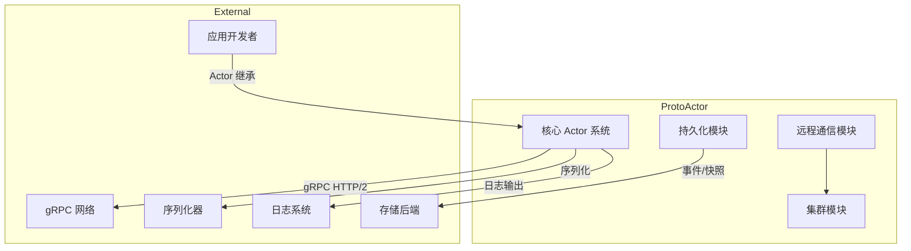

### 1.2 关键用例与交互模型

#### 用例优先级列表
| 优先级 | 用例名称 | 参与者 | 业务价值 |
|--------|----------|--------|----------|
| P0 | Actor 消息传递 | 应用开发者 | 框架核心功能 |
| P0 | Actor 生命周期管理 | 应用开发者 | 容错与重启 |
| P1 | 远程 Actor 通信 | 应用开发者/集群节点 | 分布式扩展 |
| P1 | 集群 Gossip 协议 | 集群节点 | 成员发现与拓扑感知 |
| P2 | 发布订阅事件 | 应用开发者 | 解耦与事件驱动 |

#### UC-01: Actor 消息传递
**参与者**：应用开发者、发送方 Actor、接收方 Actor

**前置条件**：
- ActorSystem 已初始化
- 发送方和接收方 Actor 已创建

**主成功流程**：
1. 发送方 Actor 调用 `context.Send(targetPid, message)`
2. PID 将消息封装为 MessageEnvelope
3. 消息被推送到目标 Actor 的 Mailbox 队列
4. Dispatcher 从 Mailbox 取出消息
5. Dispatcher 在线程池中调用接收方 Actor 的 `Receive(context)`
6. 接收方 Actor 处理消息

**异常流程**：
- 目标 PID 不存在：消息路由到 DeadLetter Office
- 邮箱已满：根据配置策略（丢弃/阻塞/重试）

**质量目标**：
- 单次消息延迟 < 10 微秒（本地）
- 吞吐量 > 100 万消息/秒（单节点）

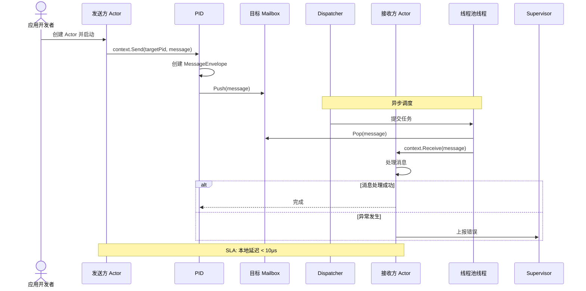

#### UC-02: Actor 生命周期管理（监督与重启）
**参与者**：应用开发者、Supervisor Actor、Child Actor

**前置条件**：
- Supervisor Actor 存在并配置了监督策略
- Child Actor 已被创建

**主成功流程**：
1. Child Actor 在处理消息时抛出异常
2. Supervisor 接收 Child 抛出的异常
3. Supervisor 的 Decider 函数决定处理指令（Restart/Stop/Resume/Escalate）
4. 如果是 Restart：Child Actor 被停止并重新创建
5. 新的 Child Actor 开始处理消息

**异常流程**：
- Decider 返回 Stop：Child Actor 永久停止
- Decider 返回 Escalate：错误向上传递给父级 Supervisor

**质量目标**：
- 检测异常 < 1ms
- 重启完成 < 100ms

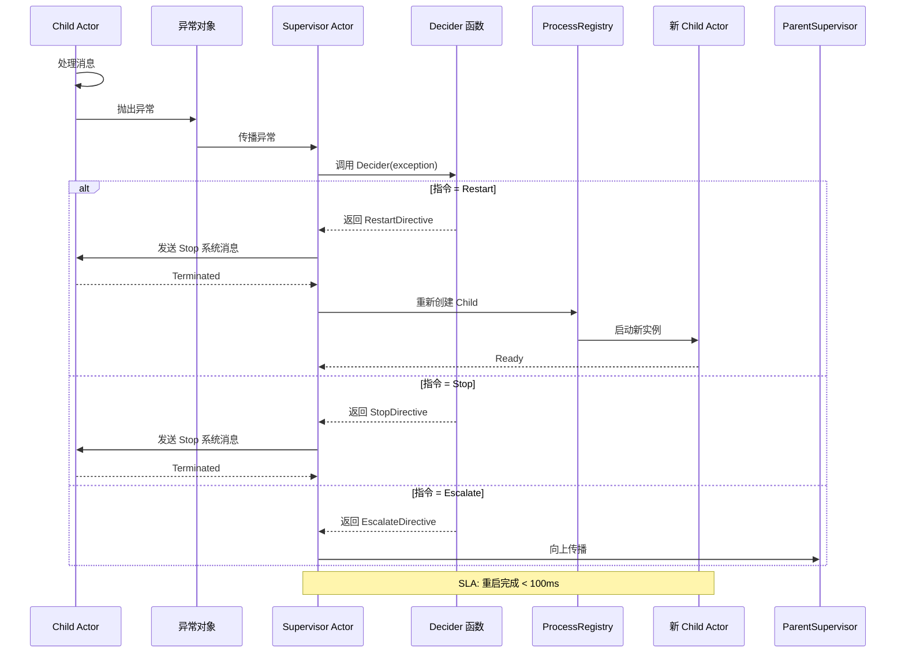

#### UC-03: 远程 Actor 通信
**参与者**：应用开发者、本地 Actor、Remote Module、远程节点

**前置条件**：
- gRPC 模块已启用
- Remote 已启动并绑定端口
- 目标 PID 的 address 为远程地址

**主成功流程**：
1. 本地 Actor 调用 `context.Send(remotePid, message)`
2. Remote Module 序列化消息（Protobuf 或 JSON）
3. Remote Module 通过 gRPC 发送到远程节点
4. 远程节点接收并反序列化消息
5. 远程节点将消息投递给目标 Actor

**异常流程**：
- 远程节点不可达：消息进入发送队列，等待重试或超时
- 反序列化失败：记录错误，发送到 DeadLetter

**质量目标**：
- 跨节点消息延迟 < 1ms（同机房）/ < 10ms（跨机房）
- 网络故障恢复时间 < 5s

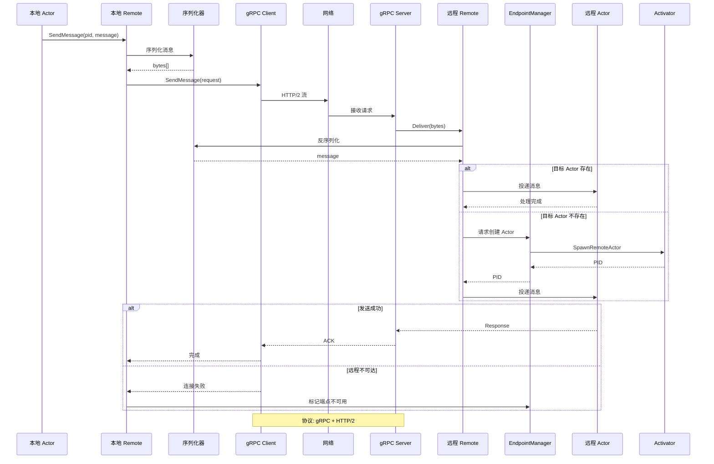

#### UC-04: 集群 Gossip 协议
**参与者**：集群节点、Gossiper、MemberList

**前置条件**：
- 集群已启动
- 至少有一个种子节点已配置

**主成功流程**：
1. 节点 A 加入集群，连接到种子节点
2. 节点 A 获取当前成员列表
3. 节点 A 定期向随机选择的成员发送 Gossip 消息
4. 成员更新自己的成员列表状态
5. 当成员检测到心跳超时，标记为不可用

**异常流程**：
- 种子节点不可达：尝试其他种子节点
- 网络分区：根据配置策略（如 majority）决定处理方式

**质量目标**：
- 成员变更传播延迟 < 1s
- 故障检测时间 < 5s

```mermaid
sequenceDiagram
    participant NodeA as 节点 A
    participant Seed as 种子节点
    participant MemberList as 成员列表
    participant Gossiper as Gossiper
    participant NodeB as 节点 B
    participant NodeC as 节点 C

    NodeA->>Seed: Join 请求
    Seed-->>NodeA: 返回当前成员列表
    NodeA->>MemberList: 更新本地列表

    loop 每 1 秒
        Gossiper->>Gossiper: 选择随机成员
        Gossiper->>NodeB: Gossip 心跳
        NodeB->>MemberList: 更新状态
        NodeB-->>Gossiper: ACK
    end

    NodeA->>NodeC: Gossip 心跳
    NodeC-->>NodeA: ACK

    alt 成员下线
        NodeA->>MemberList: 心跳超时
        MemberList->>MemberList: 标记为 Down
        MemberList->>Gossiper: 广播状态变更
        Gossiper->>NodeB,NodeC: Member Down 事件
    end

    Note over MemberList: SLA: 故障检测 < 5s
```

---

## 二、逻辑视图（Logical View）

### 2.1 结构模型

#### 架构风格选择
选择**分层架构 + Actor 模型**的组合风格：
- **分层架构**：清晰的职责分离，便于维护和测试
- **Actor 模型**：天然并发安全，避免共享状态锁

#### 架构决策记录（ADR-001）
| 字段 | 内容 |
|------|------|
| 决策标题 | 采用分层架构 + Actor 模型 |
| 状态 | 已接受 |
| 背景 | 需要同时满足代码可维护性和高并发性能要求。Actor 模型提供天然并发安全，分层架构提供清晰的职责分离。 |
| 决策 | 使用五层架构（应用层、Actor系统层、基础设施层、远程集群层、持久化层）+ Actor 并发模型 |
| 备选方案 | 微服务架构：优点：可独立部署；缺点：架构复杂，性能开销大。单体架构：优点：简单；缺点：无法满足分布式需求。 |
| 后果 | ✅ 正面影响：良好的模块边界，易于测试和扩展；Actor 模型避免共享状态锁。⚠️ 负面影响/风险：需要管理 Actor 间消息传递的复杂性；跨层接口需要稳定性保证。📌 需关注：文档需清晰说明各层职责；接口变更需谨慎。 |

#### 分层职责说明

| 层级 | 模块 | 职责 |
|------|------|------|
| 应用层 | User-defined Actors | 用户业务逻辑实现 |
| Actor系统层 | Actor, PID, Context, Props, Mailbox, Dispatcher, Behavior, Middleware | Actor 核心抽象和调度 |
| 基础设施层 | ProcessRegistry, EventStream, DeadLetter, ThreadPool | 系统级服务和运行时支持 |
| 远程集群层 | Remote, EndpointManager, Cluster, Gossiper, PubSub, Router | 跨节点通信和集群管理 |
| 持久化层 | Provider State, Event Sourcing, Snapshot | 状态持久化和恢复 |

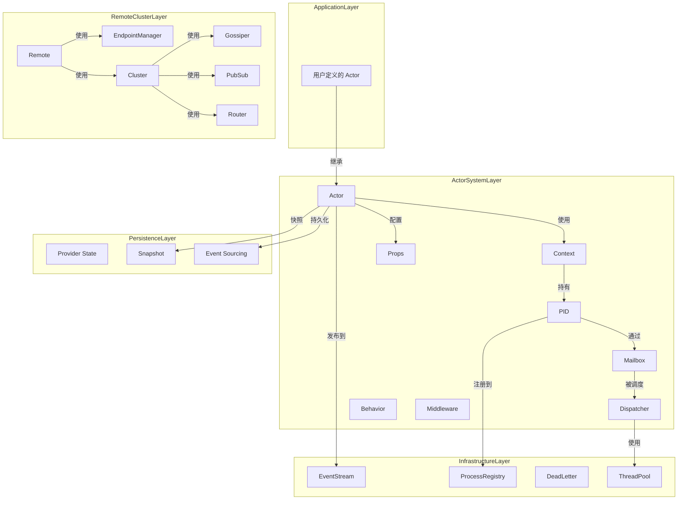

#### 关键组件接口定义

**Actor 接口**
```cpp
class Actor {
public:
    virtual ~Actor() = default;
    virtual void Receive(std::shared_ptr<Context> context) = 0;
};
```

**Context 接口**（核心方法）
| 方法分类 | 方法签名 | 功能 |
|----------|----------|------|
| Info | `Self()`, `Parent()`, `GetActor()` | 获取自身、父级、Actor 实例 |
| Message | `Message()`, `MessageHeader()`, `Sender()` | 获取消息元数据 |
| Sending | `Send()`, `Request()`, `RequestFuture()` | 发送消息 |
| Spawning | `Spawn()`, `SpawnPrefix()`, `SpawnNamed()` | 创建子 Actor |
| Lifecycle | `Stop()`, `Poison()`, `Watch()` | 生命周期管理 |
| Behavior | `Stash()`, `Unstash()` | 行为管理 |

### 2.2 行为模型

#### 核心业务流程：消息发送与投递

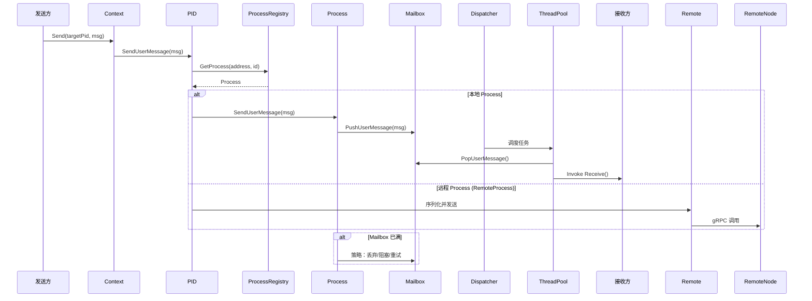

#### Actor 生命周期状态机

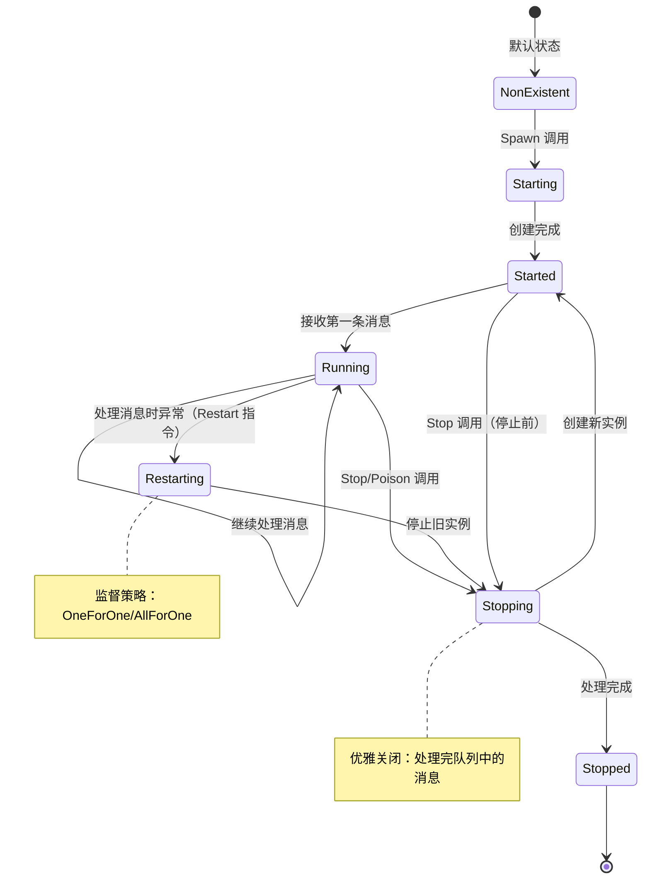

#### 远程消息处理流程

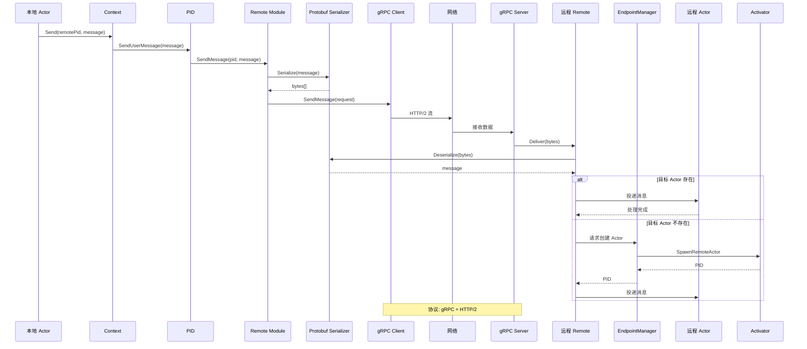

### 2.3 数据模型

#### 核心实体定义

**PID（进程标识符）**
| 字段 | 类型 | 约束 | 说明 |
|------|------|------|------|
| address | string | 非空 | ActorSystem 的网络地址 |
| id | string | 非空 | 地址内的唯一标识符 |
| request_id | uint32_t | 原子递增 | 请求-响应模式中的请求 ID |
| process_ptr_ | Process* | 原子缓存 | 缓存的进程指针（内部） |

**MessageEnvelope（消息信封）**
| 字段 | 类型 | 约束 | 说明 |
|------|------|------|------|
| message | shared_ptr\<void\> | 必需 | 消息内容（类型擦除） |
| header | MessageHeader | 可选 | 消息头部元数据 |
| sender | shared_ptr\<PID\> | 可选 | 发送方 PID |

**Member（集群成员）**
| 字段 | 类型 | 约束 | 说明 |
|------|------|------|------|
| host | string | 必需 | 主机地址 |
| port | int | > 0, < 65536 | 端口号 |
| id | string | 唯一 | 成员 ID |
| status | MemberStatus | 枚举 | Joining/Up/Leaving/Down |
| topology_sort_order | int | 排序键 | 拓扑排序键 |

#### 数据所有权边界

| 数据实体 | 拥有者 | 访问权限 |
|----------|--------|----------|
| Actor 实例 | ActorContext | 仅通过 Context 访问 |
| Process | ProcessRegistry | 全局注册，通过 PID 访问 |
| PID | 创建者 | 可跨 Actor 传递 |
| Message | 发送方 | 所有权转移给接收方 |
| Mailbox 队列 | ActorProcess | 线程安全访问 |
| 集群成员列表 | Cluster | Gossiper 更新，只读访问 |

#### 关键索引策略
- **PID 注册表**：基于 `address + id` 的复合键哈希查找
- **集群成员列表**：基于 `id` 的哈希索引，基于 `status` 的分类索引
- **端点管理器**：基于 `address` 的连接池索引

#### 数据分区/分片策略
- 集群成员：按拓扑哈希分区
- PID 缓存：按 ID 分区

#### 敏感数据识别和加密策略
- 网络地址：明文存储
- 端口号：明文存储
- 序列化消息：使用 gRPC TLS 加密（可选）

```mermaid
erDiagram
    ACTORSYSTEM ||--o{ ACTOR : "托管"
    ACTOR ||--|{ CONTEXT : "关联"}
    PID ||--|| ACTOR : "标识"
    PID ||--|| PROCESS : "解析"
    PROCESS ||--|| MAILBOX : "拥有"
    MAILBOX ||--o{ MESSAGEENVELOPE : "队列"}

    ACTORSYSTEM {
        string name
        string address
        shared_ptr ProcessRegistry registry
        shared_ptr ThreadPool thread_pool
    }

    ACTOR {
        string class_name
        shared_ptr Props props
        shared_ptr Context context
    }

    PID {
        string address
        string id
        uint32_t request_id
        atomic Process* cached_ptr
    }

    PROCESS {
        string pid_key
        enum status
        shared_ptr Mailbox mailbox
    }

    MAILBOX {
        enum mailbox_type
        shared_ptr Queue user_messages
        shared_ptr Queue system_messages
    }

    MESSAGEENVELOPE {
        shared_ptr void message
        shared_ptr PID sender
        MessageHeader* headers
    }

    CONTEXT {
        shared_ptr PID self
        shared_ptr PID parent
        shared_ptr Actor actor
    }

    CLUSTER ||--o{ MEMBER : "包含"}
    MEMBER ||--o{ TOPOLOGY : "参与"}

    CLUSTER {
        string name
        shared_ptr MemberList member_list
    }

    MEMBER {
        string id
        string host
        int port
        enum status
        int topology_sort_order
    }

    TOPOLOGY {
        vector Member sorted_members
        string consensus_id
    }
```

### 2.4 技术模型

#### 技术选型清单

| 类别 | 技术 | 版本 | 用途 | 选型理由 |
|------|------|------|------|----------|
| 语言 | C++ | 11+ | 后端实现 | 强类型，团队熟悉度高 |
| 线程库 | pthread | 系统库 | 线程管理 | 跨平台标准，性能可靠 |
| 构建系统 | CMake | 3.10+ | 构建配置 | 跨平台构建事实标准 |
| 远程通信 | gRPC | 1.50+ | RPC 框架 | HTTP/2 支持，高性能，跨语言兼容 |
| 序列化 | Protobuf | 23+ | 消息编码 | 高效二进制格式，Schema 驱动 |
| 序列化（可选） | nlohmann/json | 3.11+ | JSON 支持 | 现代化 JSON 库，易用性高 |
| 日志 | spdlog | 1.11+ | 结构化日志 | 高性能异步日志，易用性好 |
| 测试框架 | 自研轻量框架 | - | 单元测试 | 零外部依赖，与项目集成紧密 |
| 监控 | 自研 | - | 指标收集 | 灵活可扩展 |

#### 通信框架

**本地通信**
- 机制：内存队列（Mailbox）+ 线程池调度
- 协议：C++ 函数调用（虚函数）
- 数据格式：C++ 对象（类型擦除为 shared_ptr\<void\>）

**远程通信**
- 协议：gRPC over HTTP/2
- 数据格式：Protobuf（默认）或 JSON（可选）
- 传输：TCP + TLS（可选）

#### 并发运行框架

**线程池模型**
```
┌─────────────────────────────────────┐
│         ThreadPool                │
│  ┌─────┐ ┌─────┐ ┌─────┐       │
│  │ T1  │ │ T2  │ │ TN  │       │
│  └─────┘ └─────┘ └─────┘       │
└─────────────────────────────────────┘
         │           │           │
         ▼           ▼           ▼
    ┌─────────────────────────────┐
    │     Dispatcher             │
    │  ┌─────────────────────┐   │
    │  │      Mailbox Queue          │   │
    │  └─────────────────────┘   │
    └─────────────────────────────┘
         │                │                     │
         ▼                     ▼                     │
    ┌─────────────────────────────┐    │
    │      Thread Pool            │    │
    │  ┌─────┐ ┌─────┐ ┌─────┐   │    │
    │  │ T1  │ │ T2  │ │ TN  │   │    │
    │  └─────┘ └─────┘ └─────┘   │    │
    └─────────────────────────────┘    │
└─────────────────────────────────────┘
```

**调度器类型**
- DefaultDispatcher：高吞吐量，一个线程处理多个 Actor 的 Mailbox
- SynchronizedDispatcher：低延迟，保证 Actor 内消息顺序，单线程处理

#### 可观测性框架

| 支柱 | 实现 | 格式 | 存储 |
|------|------|------|------|
| 日志 | spdlog 或 std::cout | 文本（带时间戳） | 文件 / stdout |
| 指标 | metrics 模块 | 计数器 / 仪表盘 | 可扩展输出 |
| 链路追踪 | MessageHeader | request_id 跟踪 | 可扩展输出 |

---

## 三、开发视图（Development View）

### 3.1 代码模型

#### 仓库组织策略
采用 **Monorepo** 策略，所有模块在同一仓库中管理，便于跨模块引用和统一版本控制。

#### 完整目录结构

```
protoactor-cpp/
├── CMakeLists.txt                 # CMake 构建配置
├── Makefile                      # Make 构建入口
├── build.sh                      # 构建脚本
│
├── include/external/            # 公共头文件（API）
│   ├── actor.h                   # Actor 抽象基类
│   ├── pid.h                     # PID（进程标识符）
│   ├── context.h                 # Context 接口
│   ├── props.h                   # Props（Actor 配置）
│   ├── actor_system.h            # ActorSystem 类
│   ├── behavior.h                # 行为管理
│   ├── supervision.h             # 监督策略
│   ├── messages.h                # 消息类型定义
│   ├── mailbox.h                 # Mailbox 接口
│   ├── dispatcher.h              # Dispatcher 接口
│   ├── thread_pool.h             # ThreadPool 类
│   ├── future.h                  # Future/Promise
│   ├── eventstream.h             # EventStream 类
│   ├── persistence.h             # 持久化接口
│   ├── config.h                  # 配置管理
│   ├── extensions.h              # 扩展机制
│   ├── cluster/                 # 集群模块公共接口
│   ├── remote/                  # 远程通信模块公共接口
│   └── router/                  # 路由模块公共接口
│
├── include/internal/            # 内部头文件（实现细节，不安装）
│   ├── actor/                   # Actor 内部实现
│   ├── cluster/                 # 集群内部实现
│   ├── remote/                  # 远程内部实现
│   ├── router/                  # 路由内部实现
│   ├── queue/                   # 队列实现
│   ├── scheduler/               # 调度器内部实现
│   ├── metrics/                 # 指标内部实现
│   └── ...
│
├── src/                         # 源文件实现
│   ├── actor/                    # Actor 核心实现
│   ├── cluster/                 # 集群实现
│   ├── remote/                  # 远程实现
│   ├── router/                  # 路由实现
│   └── ...
│
├── proto/                       # Protobuf 定义文件
│
├── examples/                    # 示例代码
│   ├── hello_world.cpp
│   ├── supervision_example.cpp
│   ├── behavior_example.cpp
│   ├── router_example.cpp
│   ├── middleware_example.cpp
│   ├── persistence_example.cpp
│   ├── remote_example.cpp
│   ├── cluster_example.cpp
│   ├── pubsub_example.cpp
│   └── perf_benchmark.cpp
│
├── tests/                       # 测试
│   ├── test_common.h             # 轻量级测试框架
│   │
│   ├── unit/                    # 单元测试
│   ├── functional/              # 功能测试
│   ├── integration/             # 集成测试
│   └── scripts/               # 测试脚本
│
└── docs/                        # 文档
    ├── architecture.md             # 本架构文档
    ├── BUILD_AND_REMOTE.md       # 构建指南
    ├── API_REFERENCE.md         # API 参考
    ├── COMPARISON_AND_MIGRATION.md
    ├── TESTING.md
    └── README.md
```

#### 逻辑组件到代码路径映射

| 逻辑组件 | 代码路径 | 关键类/接口 |
|----------|----------|-------------|
| Actor 核心 | `include/external/*.h`, `src/actor/` | `Actor`, `Context`, `PID`, `Props` |
| 邮箱与调度 | `src/actor/mailbox.cpp`, `src/actor/dispatcher.cpp` | `Mailbox`, `Dispatcher` |
| 线程池 | `src/actor/thread_pool.cpp` | `ThreadPool` |
| 进程注册表 | `src/actor/process_registry.cpp` | `ProcessRegistry` |
| 远程通信 | `include/external/remote/`, `src/remote/` | `Remote`, `RemoteProcess`, `EndpointManager` |
| 集群管理 | `include/external/cluster/`, `src/cluster/` | `Cluster`, `Gossiper`, `MemberList` |
| 路由系统 | `include/external/router/`, `src/router/` | `Router`, `RouterGroup` |
| 持久化 | `src/persistence/` | `Persistence`, `EventSourcing` |
| 事件流 | `src/actor/eventstream.cpp` | `EventStream` |

#### 命名约定和代码规范引用
- **类名**：PascalCase（如 `Actor`, `Context`, `PID`）
- **函数名**：PascalCase（如 `Receive`, `Send`, `Spawn`）
- **变量名**：snake_case（如 `actor_system`, `process_ptr`）
- **成员变量**：snake_case + 下划线后缀（如 `process_ptr_`）
- **常量**：UPPER_SNAKE_CASE（如 `MAX_RETRY_COUNT`）
- **命名空间**：全部小写（如 `protoactor`）
- **文件名**：snake_case（如 `actor_system.cpp`, `pid.h`）

### 3.2 构建模型

#### 构建工具链及版本

| 工具 | 版本 | 用途 |
|------|------|------|
| CMake | 3.10+ | 构建配置 |
| GCC | 4.8+ / Clang 3.3+ | 编译器 |
| Make | 任意版本 | 构建执行 |
| gRPC | 1.50+（可选） | 远程通信 |
| Protobuf | 23+（可选） | 序列化 |
| spdlog | 1.11+（可选） | 日志 |

#### 构建阶段定义

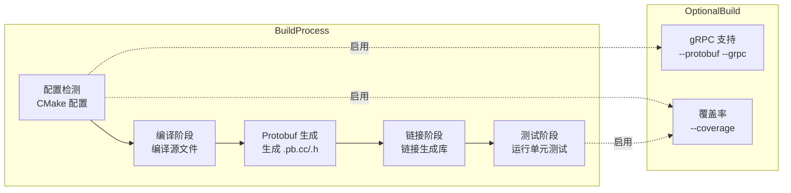

#### 测试策略

| 测试类型 | 范围 | 覆盖率要求 | 框架 |
|----------|------|-------------|------|
| 单元测试 | 每个模块的核心函数 | 60%+ 行覆盖率 | 自研轻量框架 |
| 集成测试 | Actor 集成场景 | 关键路径 100% | 自研框架 |
| 性能测试 | 线程池/Dispatcher/Actor 吞吐量基准 | - | 自定义基准 |

#### CI/CD 流水线阶段定义

| 阶段 | 名称 | 触发条件 | 操作 |
|------|------|----------|------|
| 编译 | Build | 代码变更 | CMake 配置 + 编译 |
| 单元测试 | Unit Test | 编译成功 | 运行单元测试 |
| 集成测试 | Integration Test | 单元测试通过 | 运行集成测试 |
| 安全扫描 | Scan | 每日 | 依赖漏洞扫描 |
| 镜像构建 | Image Build | 扫描通过 | 构建容器镜像 |
| 部署 | Deploy | 合并到 main | 自动部署到环境 |

#### 依赖管理策略
- **必需依赖**：pthread, C++11 标准库（系统自带）
- **可选依赖**：gRPC, Protobuf, spdlog, nlohmann/json
- **版本锁定**：CMakeLists.txt 中定义最低版本要求
- **私有仓库**：无（所有依赖为公共仓库）

### 3.3 硬件模型

#### 开发/测试环境

| 环境 | CPU | 内存 | 存储 | 备注 |
|------|-----|------|------|------|
| 开发 | x86_64 / ARM64 2 核 | 4GB | 10GB SSD | 本地开发 |
| 测试 | x86_64 / ARM64 4 核 | 8GB | 20GB SSD | CI 环境 |
| 覆盖率构建 | x86_64 / ARM64 2 核 | 4GB | 20GB SSD | gcov/lcov |

#### 生产环境建议

| 组件 | CPU 架构 | 最小配置 | 推荐配置 |
|------|----------|----------|----------|
| ActorSystem 应用 | x86_64 / ARM64 | 2 核 2GB | 4+ 核 4GB |
| gRPC 服务器 | x86_64 / ARM64 | 2 核 2GB | 8+ 核 8GB |
| 集群节点 | x86_64 / ARM64 | 4 核 4GB | 8+ 核 16GB |

#### 硬件配置框图

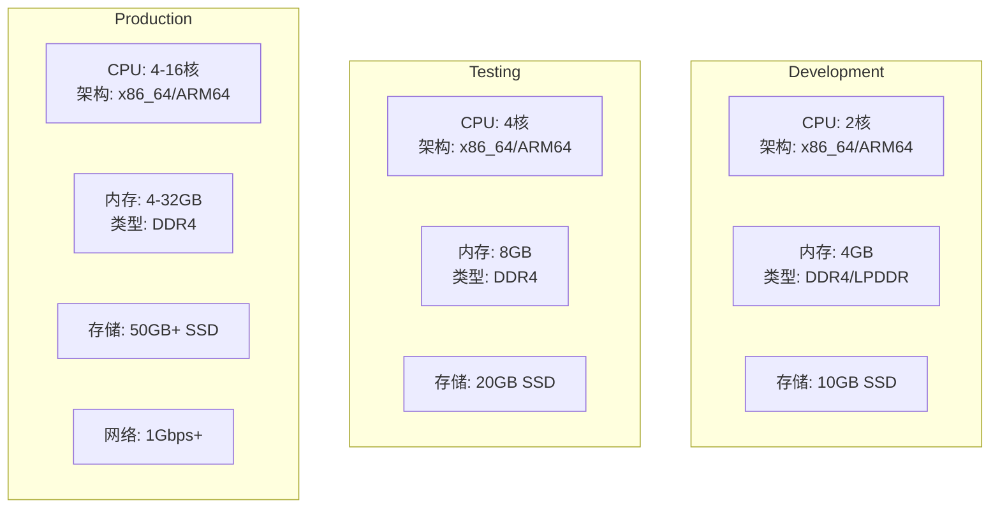

---

## 四、运行视图（Process View）

### 4.1 运行模型

#### 进程/线程/并发模型

**单进程架构**
- 主进程：单个 `ActorSystem` 进程
- 线程池：默认使用 CPU 核心数的线程
- 消息处理：无锁队列（MPSC）+ 线程池调度

#### 并发模型图

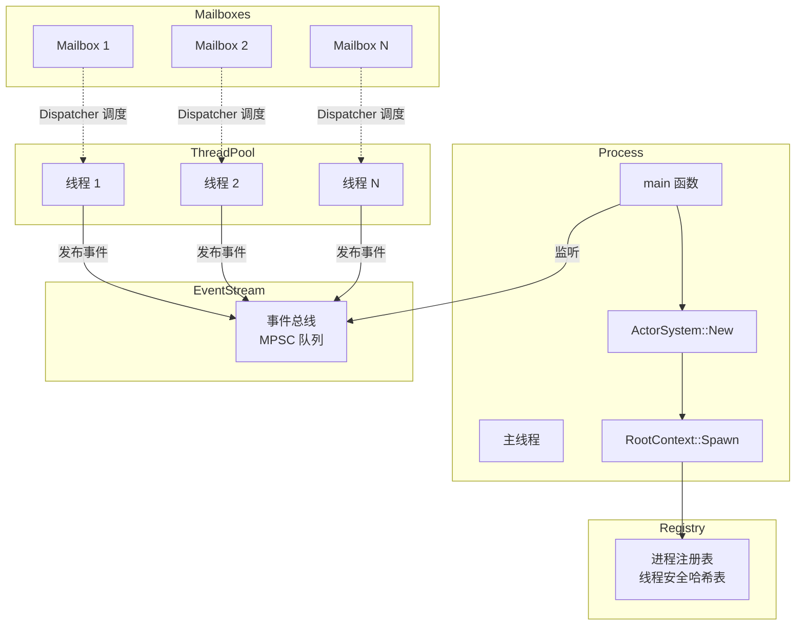

#### 高可用设计

**故障检测**
- Actor 异常：由监督策略处理
- 线程崩溃：ThreadPool 监控，重新创建
- 远程节点断开：EndpointManager 检测心跳超时

**故障转移**
- Actor 重启：OneForOne/AllForOne 策略
- 远程消息重试：EndpointManager 自动重连
- 集群成员重新平衡：Gossip 协议自动发现

| 场景 | 检测机制 | 恢复策略 | RTO 目标 |
|------|----------|----------|---------|
| 线程故障 | ThreadPool 监控 | 自动重启/流量摘除 | < 30s |
| 远程节点断开 | 心跳超时 | 自动重连 / 消息队列 | < 5s |
| 外部依赖不可用 | 熔断器 | 返回降级响应 | 即时 |

#### 弹性伸缩策略

**水平扩展**
- 集群模式：通过添加新节点扩展
- 无状态设计：Actor 可以迁移到任意节点

**垂直扩展**
- 线程池大小：根据 CPU 核心数自动调整
- Mailbox 容量：可配置，默认无界

#### 流量控制

| 类型 | 策略 | 参数 |
|------|------|------|
| 限流 | Mailbox 容量限制 | `mailbox_size`（默认无界） |
| 降级 | 丢弃溢出消息 | `overflow_strategy` |
| 熔断 | EndpointManager | `max_retries`, `backoff_ms` |

#### 启动和关闭流程

**启动流程**
1. 创建 ActorSystem
2. 初始化 ThreadPool
3. 创建 RootContext
4. 启动 Remote（如果启用）
5. 启动 Cluster（如果启用）

**优雅关闭**
1. 停止接受新消息
2. 处理完 Mailbox 中剩余消息
3. 停止所有子 Actor
4. 关闭 ThreadPool
5. 清理资源

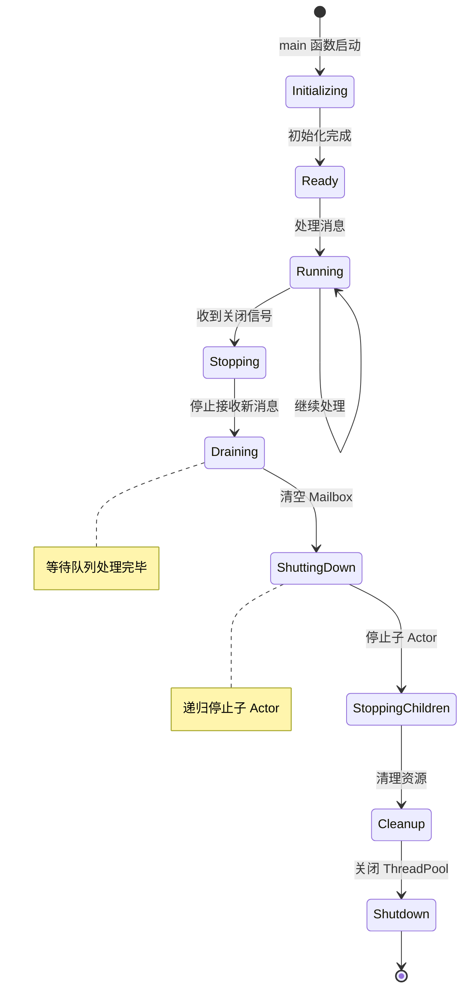

### 4.2 运维模型

#### 可观测性三支柱

**日志**
- 框架：spdlog（如果可用）或 std::cout
- 格式：`[时间] [级别] [模块] 消息`
- 级别：TRACE, DEBUG, INFO, WARN, ERROR

**指标**
- 类型：Counter（计数器）、Gauge（仪表盘）
- 示例：`messages_sent_total`, `actors_active_count`

**链路追踪**
- 机制：MessageHeader 中的 `request_id` 跟踪
- 传播：自动跨 Actor 传递

#### 可观测性架构

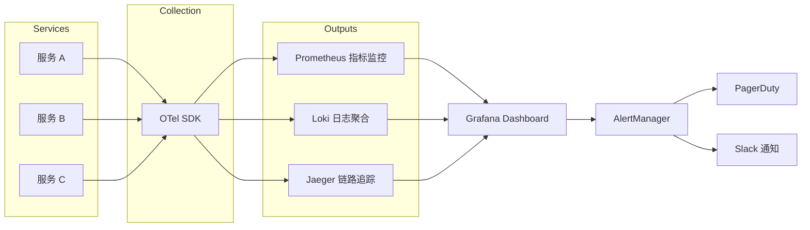

#### 关键 SLI/SLO 定义

| 指标 | SLI 定义 | SLO 目标 | 告警阈值 |
|------|----------|----------|---------|
| 可用性 | 成功请求数 / 总请求数 | 99.9% / 月 | < 99.5% 触发告警 |
| 延迟（P99） | 第 99 百分位响应时间 | < 500ms | > 1000ms 触发告警 |
| 错误率 | 5xx 响应数 / 总请求数 | < 0.1% | > 1% 触发 P1 告警 |
| 吞吐量 | 每秒处理请求数 | 支持 1000 QPS | 持续 > 800 QPS 扩容 |

#### 告警策略

| 级别 | 触发条件 | 通知渠道 | 响应 SLA |
|------|----------|----------|---------|
| P1（严重） | 服务不可用、数据丢失 | PagerDuty + 短信 | 5 分钟内 |
| P2（警告） | 高延迟、高错误率 | Slack + 邮件 | 30 分钟内 |
| P3（信息） | 容量预警 | Slack | 4 小时内 |

#### 健康检查端点设计

**检查端点**
- 进程存活检查：默认线程池和注册表状态检查
- 服务就绪检查：Remote/Cluster 已启动状态检查

**检查内容**
- ThreadPool 状态（活跃线程数）
- ProcessRegistry 状态（注册 Actor 数）
- Remote 连接状态（如果启用）

---

## 五、部署视图（Deployment View）

### 5.1 交付模型

#### 交付产物类型和格式

| 制品 | 类型 | 格式 | 说明 |
|------|------|------|------|
| 静态库 | libprotoactor-cpp.a | .a | 静态链接 |
| 动态库 | libprotoactor-cpp.so | .so | 动态链接 |
| 头文件 | include/external/*.h | .h | API 声明 |
| 示例程序 | 可执行文件 | 二进制 | 示例代码 |
| 测试程序 | 可执行文件 | 二进制 | 测试套件 |

#### 命名规范

**库文件**
```
libprotoactor-cpp.{a,so}
libprotoactor-cpp.{a,so}.1.0.0
```

**头文件**（安装后）
```
include/protoactor/{module}/{name}.h
```

#### 多环境交付策略

| 环境 | 构建类型 | 调试信息 | 优化级别 |
|------|----------|----------|----------|
| Debug | Debug | 包含 | -O0 |
| Release | Release | 不包含 | -O3 |

#### 制品安全措施

**代码安全**
- 编译器警告：`-Wall -Wextra -Wpedantic`

**依赖安全**
- 最小化依赖：仅依赖必要的第三方库
- 可选依赖：gRPC, Protobuf, spdlog 可选

### 5.2 部署模型

#### 部署拓扑图

```mermaid
graph TB
    subgraph Internet
        Users[用户]
    end

    subgraph Cloud
        subgraph AZ1
            LB1[ALB / Nginx<br/>轮询 + 健康检查]
            subgraph K8sA
                APIPod1[API Pod 1<br/>2C4G]
                WorkerPod1[Worker Pod 1<br/>2C8G]
            end
            PGPrimary[(PostgreSQL Primary<br/>8C32G SSD 500G]
        end

        subgraph AZ2
            subgraph K8sB
                APIPod2[API Pod 2<br/>2C4G]
                WorkerPod2[Worker Pod 2<br/>2C8G]
            end
            PGReplica[(PostgreSQL Replica<br/>8C32G SSD 500G]
        end

        subgraph Shared
            Redis[(Redis Cluster<br/>3主3从]
            Kafka[Kafka Cluster<br/>3 Broker / 3 副本]
            S3[对象存储<br/>OSS / S3]
        end
    end

    Users --> LB1
    LB1 --> APIPod1 & APIPod2
    APIPod1 & APIPod2 -->|写| PGPrimary
    APIPod1 & APIPod2 -->|读| PGReplica
    PGPrimary -->|流复制| PGReplica

    APIPod1 & APIPod2 <--> Redis & Kafka & S3
    APIPod1 & APIPod2 --> WorkerPod1
    WorkerPod1 --> Redis & Kafka & S3

    APIPod2 --> WorkerPod2
    WorkerPod2 --> Redis & Kafka & S3
```

#### 各服务副本数/资源配额

| 服务 | 副本数 | CPU Request | CPU Limit | 内存 Request | 内存 Limit |
|------|--------|-------------|-----------|-------------|-----------|
| API 服务 | 3-10（自动扩缩） | 1核 | 2核 | 2GB | 4GB |
| Worker 服务 | 1-3（固定） | 2核 | 4核 | 4GB | 8GB |
| PostgreSQL | 2（主从） | 4核 | 8核 | 16GB | 32GB |
| Redis | 6（3主3从） | 1核 | 2核 | 2GB | 4GB |
| Kafka | 3（3 副本） | 2核 | 4核 | 4GB | 8GB |

#### 网络分区设计

| 分区 | 用途 | 网络 |
|------|------|------|
| 公网 | 用户访问 | LB 所在 VPC |
| 私有网 | 内部服务通信 | 服务间网络 |
| 数据库网 | 数据库访问 | 专用子网 |

#### 存储挂载

| 存储 | 类型 | 大小 | 挂载点 |
|------|------|------|--------|
| PostgreSQL | SSD 500G | /var/lib/postgresql |
| Redis | SSD 100G | /data |
| S3/OSS | 对象存储 | - |

#### 冗余策略

- **跨可用区部署**：AZ1 + AZ2
- **数据库主从复制**：自动故障转移
- **Redis 集群**：3 主 3 从
- **Kafka 分区副本**：3 副本 3 副本

#### 各环境配置矩阵表格

| 配置项 | 开发环境 | 预发环境 | 生产环境 |
|--------|----------|----------|----------|
| API 副本数 | 1 | 2 | 3-10（自动扩缩） |
| 数据库规格 | 2C4G | 4C8G | 8C32G 主从 |
| 缓存规格 | 单节点 | 单节点 | 集群 3+3 |
| 日志级别 | DEBUG | INFO | WARN |
| 调用外部真实服务 | Mock | 沙箱 | 生产 |

#### 数据库迁移和回滚策略

**持久化迁移**
- 事件溯源：事件不可变，无需迁移
- 快照：版本化存储，兼容旧格式

**回滚策略**
- Actor 状态：通过重放事件恢复
- 配置：回退到先前版本的配置文件

---

## 六、架构决策记录（ADR）

### ADR-001：采用分层架构 + Actor 模型

- **日期**：2026-02-18
- **状态**：已接受
- **背景**：需要同时满足代码可维护性和高并发性能要求。Actor 模型提供天然并发安全，分层架构提供清晰的职责分离。
- **决策**：使用五层架构（应用层、Actor系统层、基础设施层、远程集群层、持久化层）+ Actor 并发模型。
- **备选方案**：
  - 微服务架构：优点：可独立部署；缺点：架构复杂，性能开销大。
  - 单体架构：优点：简单；缺点：无法满足分布式需求。
- **后果**：
  - ✅ 正面影响：良好的模块边界，易于测试和扩展；Actor 模型避免共享状态锁。
  - ⚠️ 负面影响/风险：需要管理 Actor 间消息传递的复杂性；跨层接口需要稳定性保证。
  - 📌 需关注：文档需清晰说明各层职责；接口变更需谨慎。

### ADR-002：使用 C++11 标准

- **日期**：2026-02-18
- **状态**：已接受
- **背景**：需要在性能和兼容性之间平衡。C++11 提供了必要的并发原语（std::thread, std::atomic, std::shared_ptr），同时广泛支持。
- **决策**：使用 C++11 作为最低标准，兼容 GCC 4.8+ 和 Clang 3.3+。
- **备选方案**：
  - C++14/17：优点：更多语言特性；缺点：降低兼容性，部分旧编译器不支持。
  - C++98：优点：最高兼容性；缺点：缺少必要并发原语，需要更多第三方依赖。
- **后果**：
  - ✅ 正面影响：广泛支持，可以在大多数 Linux 系统上编译；std::atomic 等 STL 足够实现框架需求。
  - ⚠️ 负面影响/风险：无法使用 C++14/17 的新特性（如结构化绑定、if constexpr）。
  - 📌 需关注：未来可考虑升级到 C++14/17。

### ADR-003：采用自研轻量级测试框架

- **日期**：2026-02-18
- **状态**：已接受
- **背景**：需要测试框架，但希望避免引入大型外部依赖（如 Google Test）。测试需求相对简单，主要是单元测试和功能测试。
- **决策**：实现自研轻量级测试框架，定义在 `tests/test_common.h`，提供基本的断言宏（ASSERT_TRUE, ASSERT_EQ）和测试运行器。
- **备选方案**：
  - Google Test：优点：功能丰富，生态完善；缺点：增加构建复杂度，增加依赖。
  - Catch2：优点：现代 C++，易用性好；缺点：仍然是外部依赖。
- **后果**：
  - ✅ 正面影响：零外部依赖，与项目集成紧密；构建更简单。
  - ⚠️ 负面影响/风险：功能有限，缺少高级特性（如参数化测试、mock 框架）。
  - 📌 需关注：文档需要清晰说明测试框架用法。

### ADR-004：PID 使用原子缓存 Process 指针

- **日期**：2026-02-18
- **状态**：已接受
- **背景**：PID 需要频繁解析为 Process，每次通过 ProcessRegistry 查找会带来性能开销。需要优化频繁查找场景。
- **决策**：PID 内部维护一个 `atomic<Process*>` 缓存指针，首次解析后缓存，后续直接使用。在 Process 停止时清除缓存。
- **备选方案**：
  - 每次查找 ProcessRegistry：优点：简单，无缓存一致性问题；缺点：性能开销大。
  - 使用 shared_ptr 缓存：优点：安全；缺点：shared_ptr 操作有开销，且需要解决循环引用。
- **后果**：
  - ✅ 正面影响：显著减少查找开销，提升消息发送性能。
  - ⚠️ 负面影响/风险：需要处理缓存失效场景（Process 停止时清除）；增加实现复杂度。
  - 📌 需关注：确保缓存在多线程环境下正确更新；测试缓存失效逻辑。

### ADR-005：支持 x86_64 和 ARM64 架构，不支持 32 位

- **日期**：2026-02-18
- **状态**：已接受
- **背景**：现代服务器和嵌入式设备主流使用 64 位架构。支持 32 位会增加测试和维护成本，且 32 位原子操作与 64 位存在差异。
- **决策**：仅支持 x86_64 和 ARM64（aarch64/arm64）架构，不支持 32 位系统。构建时检测架构，不匹配则报错。
- **备选方案**：
  - 支持 32 位：优点：更广泛的兼容性；缺点：增加测试成本，原子操作处理复杂。
  - 仅支持 x86_64：优点：简化；缺点：不支持 ARM 服务器。
- **后果**：
  - ✅ 正面影响：聚焦主流架构，简化测试；避免 32 位相关的复杂问题。
  - ⚠️ 负面影响/风险：无法在 32 位系统上编译运行。
  - 📌 需关注：文档需明确说明架构限制。

---

## 附录

### A. 术语表

| 术语 | 定义 |
|------|------|
| Actor | 并发计算的基本单元，拥有独立状态和行为，通过消息通信 |
| PID | Process Identifier，唯一标识一个 Actor 的地址 |
| Context | Actor 上下文，提供 Actor 与系统交互的接口 |
| Props | Actor 属性配置，包含创建参数、调度器、监督策略等 |
| Mailbox | Actor 的消息队列，存储待处理的消息 |
| Dispatcher | 调度器，从 Mailbox 取出消息并在线程池中执行 |
| ThreadPool | 线程池，管理工作线程 |
| ProcessRegistry | 进程注册表，管理所有 Process 实例 |
| EventStream | 事件总线，支持发布订阅模式 |
| Remote | 远程通信模块，支持跨节点消息传递 |
| Cluster | 集群模块，支持成员发现、Gossip 协议 |
| Router | 路由模块，支持广播、轮询、随机、一致性哈希路由 |
| Persistence | 持久化模块，支持事件溯源和快照 |
| Supervisor | 监督者，管理子 Actor 的生命周期和错误处理 |
| Middleware | 中间件，在消息接收/发送/创建时进行拦截和处理 |
| Behavior | 行为管理，支持 Become/Unbecome 模式切换 |

### B. 参考资料

- [ProtoActor Go](https://github.com/asynkron/protoactor-go)
- [Actor Model](https://en.wikipedia.org/wiki/Actor_model)
- [Kruchten 4+1 View Model](https://www.ibm.com/docs/en/rational-architect/4-plus-one-architecture-view-model)
- [gRPC Documentation](https://grpc.io/docs/)
- [Protocol Buffers](https://developers.google.com/protocol-buffers)

### C. 变更历史

| 版本 | 日期 | 变更内容 | 修订人 |
|------|------|----------|--------|
| v1.0 | 2026-02-18 | 初始版本，完整 4+1 视图架构文档 | - |
